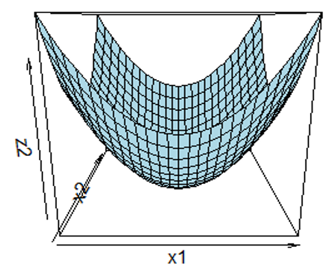

layout: true

.footnote[U.S. Department of Commerce | National Oceanic and Atmospheric Administration | National Marine Fisheries Service]


<style type="text/css">

code.cpp{
  font-size: 14px;
}
code.r{
  font-size: 14px;
}


</style>


```{r setup, include=FALSE}
options(htmltools.dir.version = FALSE)
```

```{r xaringan-tile-view, echo=FALSE}
# this gives you a tile navigation if you type "O" at any time
xaringanExtra::use_tile_view()
```
<!-- modified from Cole Monnahan's TMB training series:  https://github.com/colemonnahan/tmb_workshop-->


---
# Where to get everything

All slides and code are at [NOAA-FIMS/TMB_training](https://github.com/NOAA-FIMS/TMB_training)


```{r, echo = FALSE, out.width="60%", fig.align="left"}
knitr::include_graphics("static/tmb_training_screenshot.png")
```

---
# What is TMB?

<br>

.p[
* TMB is an R package and C++ environment for fitting statistical models
* Models are written in templated C++
* The TMB R package interfaces between R and C++
* The TMB engine implements automatic differentiation:
  - Calculates Up to the 3rd derivative
  - Parameter values and gradients (derivative vectors) are passed off to an R minimizer
 ] 
 
---
# Overview
<br>

.large[
.p[
1. Type Systems in R and C++
2. AD Review
3. Likelihoods and AD Types
]]
---

class: middle

# Type Systems in R and C++
---
# Dynamic vs. Static Typing
<br>
.pull-left[
**R: Dynamic**
.p[
- Type checking occurs at run time
- The values and types associated with names can change
- Change in type tends to be implicit
]]

.pull-right[
**C++: Static**
.p[
- Type checking occurs at compile time
- The values associated with a given name can be limited to just a few types and may be unchangeable
- Change in type tends to be explicit
]]

---
# Type Declaration Example
<br>
.pull-left[
**R: Dynamic**
```{r}
a <- 1
a <- "hello"
a <- function(x) x^2
a <- environment()
```
]

.pull-right[
**C++: Static**
```{Rcpp, eval = FALSE}
#include <iostream>
#include <string>

int main() {
    double a = 1.1;
    std::string a = "hello";
    return 0;
}
```

```{bash, eval = FALSE}
g++ ../src/lec1a.cpp -o a.exe
```
error in engine(options) : lec1a.cpp: In function 'int main()': lec1a.cpp:7:17: error: **conflicting declaration**
]

---
# R and C++ - Type Conversion Example

.pull-left[
**R: Dynamic**
```{r, eval = FALSE}
a <- 1
b <- "hello"
a + b
```
Error in a + b : non-numeric argument to binary operator

```{r}
a <- 1
b <- "hello"
c(a,b)
```
]

.pull-right[
**C++: Static**
```{Rcpp, eval = FALSE}
#include <iostream>
#include <string>

int main() {
    double x = 1.1;
    int y = x;
    std::cout << "x = " << x << "; y = " << y << std::endl;
    std::string a = "a";
    std::string b = std::to_string(y);
    std::cout << a + b;
    return 0;
}
```

```{bash, eval = FALSE}
g++ ../src/lec1b.cpp -o a.exe
a.exe
```
x = 1.1; y = 1 <br>
a1
]


---
# What is Templated C++?
<br><br>
* Generic programming
* Allows developer to write functions and classes that are independent of Type
* Templates are expanded at compile time

<br>
```{Rcpp, eval = FALSE}
template <class T>
T add(T x, T y){
  return x + y;
}
```
<br>
```{Rcpp, eval = FALSE}
template <typename Type>
Type add(Type x, Type y){
  return x + y;
}
```


---

class: middle

# Review of Automatic Differentiation
---
# What is AD?

- Symbolic differentiation
  - Converts computer program into single expression
  - Inefficient code, computationally expensive, O(2n) for n input variables
  - Higher order derivatives calculation difficult due to complexity
- Numerical differentiation
  - Approximation that relies on finite differences, O(n)
  - Trade-off between truncation error versus round-off error
  - Higher order derivatives calculation difficult due to error accumulation
- Automatic Differentiation
  - Accurate derivatives calculated automatically using the chain rule
  - Calculates higher order derivatives
  - Forward mode: O(n) 
  - Reverse mode: O(m) for m output variables, more complicated to implement algorithmically

---
# Forward Mode
<br>

```{r, echo = FALSE, out.width="70%", fig.align="left"}
knitr::include_graphics("static/forward-mode.png")
```

---
# Reverse Mode
<br>

```{r, echo = FALSE, out.width="70%", fig.align="left"}
knitr::include_graphics("static/reverse-mode.png")
```

---
# Reverse Mode
<br><br>
- Requires storage of intermediate variables along with computational instructions (‘tape’)
- Given m output variables:
  - Time cost of method: O(m)
  - Memory cost of method: O(#ops)
- Static and Dynamic computational graphs

---
# Reverse Mode
.pull-left[
**Static (cppAD, TMBad)**
The graph is constructed once before execution
- Less flexibility with conditional statements that depend on parameters. Atomic functions can be used when conditional statements depend on parameters
- High portability 
- Graph optimization possible

]

.pull-right[
**Dynamic (Stan, ADMB)**
The graph is defined as forward computation is executed at every iteration
- Flexibility with conditional statements
- Optimization routine implemented into executable
- Less time for graph optimization

]
---

class: middle

### Demystifying AD< AD< AD< double> > >

---
## From [inst/include/def.hpp](https://github.com/NOAA-FIMS/FIMS/blob/24458ce4cae439dbb4917a013a35cac5cc11b592/inst/include/common/def.hpp#L17)

```{Rcpp, eval = FALSE}
#ifdef TMB_MODEL
// simplify access to singletons
#define TMB_FIMS_REAL_TYPE double
#define TMB_FIMS_FIRST_ORDER AD<TMB_FIMS_REAL_TYPE>
#define TMB_FIMS_SECOND_ORDER AD<TMB_FIMS_FIRST_ORDER>
#define TMB_FIMS_THIRD_ORDER AD<TMB_FIMS_SECOND_ORDER>
#endif
```

def                                            |C++ Type                    |Used to evaluate
-----------------------------------------------|----------------------------|------------------
TMB_FIMS_REAL_TYPE double                      | < double >                 | 
TMB_FIMS_FIRST_ORDER AD<TMB_FIMS_REAL_TYPE>    | AD < double >              | MLE
TMB_FIMS_SECOND_ORDER AD<TMB_FIMS_FIRST_ORDER> | AD< AD < double > >        | Variance
TMB_FIMS_THIRD_ORDER AD<TMB_FIMS_SECOND_ORDER> | AD< AD< AD < double > > >  | Laplace approximation

---

class: middle

# Likelihoods and AD Types
---
# Maximum Likelihood Estimation

What is the likelihood for 30 successes in 100 trials?

.pull-left[
1. Specify the model <br><br>
$y ~ \sim Binomial(n, p)$
]
---
# ML Inference

What is the likelihood for 30 successes in 100 trials?

.pull-left[
1. Specify the model
2. Calculate the likelihood<br><br>
$L(p; n, y) = \frac{n!}{y!(n-y)!}p^y(1-p)^{n-y}$
]

.pull-right[
$L(p; n = 100, y = 30)$
```{r, eval=TRUE, echo = FALSE}
curve(dbinom(30,100,x),0,0.75, ylab = 'L(p)', xlab = 'p')
```
]
---

# ML Inference

What is the likelihood for 30 successes in 100 trials?

.pull-left[
1. Specify the model
2. Calculate the likelihood
3. Calculate the negative log-likelihood<br><br>
$-\ell(p; n, y) = -[ln\big(\frac{n!}{y!(n-y)!}\big) + yln(p)$<br>
     $$+ (n-y)ln(1-p)]$$
]

.pull-right[
$-ln\big[L(p; n = 100, y = 30)\big]$
```{r, eval=TRUE, echo = FALSE}
curve(-log(dbinom(30,100,x)),0,0.75, ylab = 'l(p)', xlab = 'p')
```
]
---

# ML Inference

What is the likelihood for 30 successes in 100 trials?

.pull-left[
1. Specify the model
2. Calculate the likelihood
3. Calculate the negative log-likelihood
$-\ell(p; n, y) = -[ln\big(\frac{n!}{y!(n-y)!}\big) + yln(p)$<br>
     $$+ (n-y)ln(1-p)]$$
4. Calculate the derivative w.r.t. $p$<br><br>
$\frac{d(\ell(p; n, y))}{dp} = \frac{y}{p}- \frac{n-y}{1-p}$
]

.pull-right[
$-ln\big[L(p; n = 100, y = 30)\big]$
```{r, eval=TRUE, echo = FALSE}
curve(-log(dbinom(30,100,x)),0,0.75, ylab = 'l(p)', xlab = 'p')
```
]
---

# ML Inference

What is the likelihood for 30 successes in 100 trials?

.pull-left[
1. Specify the model
2. Calculate the likelihood
3. Calculate the negative log-likelihood
4. Calculate the derivate wrt p
5. Set to 0 and solve for MLE<br><br>
for n = 100 and y = 30, 
\begin{align}
0 &= \frac{y}{p}- \frac{n-y}{1-p}\\
\hat{p} &= \frac{y}{n} \\
\hat{p} &= \frac{30}{100} = 0.3
\end{align}
]

.pull-right[
$-ln\big[L(p; N = 100, y = 30)\big]$
```{r, eval=TRUE, echo = FALSE}
curve(-log(dbinom(30,100,x)),0,0.75, ylab = 'l(p)', xlab = 'p')
nll <- -dbinom(30,100,.3,TRUE)
segments(0.1, nll, 0.5, nll, col='red', lwd=2)
```
]
---
class: middle

#Uncertainty

---
##Asymptotic approximation with $f''$

The second derivative measures the curvature of the likelihood and is approximately equal to the negative inverse of the variance when evaluated at the MLE

Poisson Likelihood: $f(y) = \frac{e^{-\lambda}\lambda^{y}}{y!}$, for **y = 2**:
.three-column[
log-likelihood: 


$\small \ell(\lambda) = -\lambda + ylog(\lambda) - log(y!)$
```{r echo = FALSE}
curve(log(dpois(2,x)), xlab = expression(lambda), ylab = expression("l("~ lambda ~ "|y=2)"),0,5, cex.lab = 1.5)
```

]

.three-column[
1st derivative: 

$\frac{d\ell(\lambda)}{d\lambda} = -n + \frac{y}{\lambda}$
```{r echo = FALSE}
pois.1d <- function(x,y){-1 + y/x}
curve(pois.1d(x,2), xlab = expression(lambda), ylab = expression("l("~ lambda ~ "|y=2)'"),0,5, cex.lab = 1.5)
```
$\frac{\hat{y}}{n} = \lambda$
]

.three-column[
2nd Derivative: 

$\frac{d^{2}\ell(\lambda)}{d\lambda^{2}} = -\frac{y}{\lambda^{2}}$

Evaluated at the MLE:
$$-\frac{n\lambda}{\lambda^{2}} = -\frac{n}{\lambda}$$
$$Var(\lambda) = \frac{\lambda}{n}$$

]

---
#Multivariate asymptotics

* For N-d models, the curvature is represented by a NxN **Hessian** matrix of 2nd partial derivatives
* Inverting the negative Hessian gives us a covariance matrix

\begin{align}
(\mathbb{H}_{f})_{i,j} &= \frac{\partial^2f}{\partial \theta_{i}, \partial x\theta_{j}} = \frac{-1}{Var(\Theta)}
\end{align}

.three-column[

]
.three-column[<br><br>Which will have the smaller SE?]
.three-column[

]
---
class: middle

# Hierarchical modeling with TMB

---
#The Hierarchical model<br><br><br>

$$\Large \int_{\mathbb{R}}f(y;u,\theta)f(u;\theta)du$$
---
# The Laplace approximation<br>

The marginal likelihood of the data after integrating out random effects, $u$: 
$$L(\theta) = \int_{\mathbb{R}}f(y;u,\theta)f(u;\theta)du$$
1. The random effects likelihood is minimized to find $\hat{u}$:
$$\hat{u}(\theta) = \underset{u}{argmin}f(u,\theta)$$
2. The Hessian (matrix of partial 2nd derivatives) of $f(u,\theta)$ w.r.t. $u$ is evaluated at $\hat{u}(\theta)$:
$$\mathbb{H}(\theta) = f^{"}_{uu}(\hat{u}(\theta), \theta)$$
3. The Laplace approximation for the marginal likelihood is:
$$L^{*}(\theta) = \sqrt{2\pi}^{n}det(\mathbb{H})^{-1/2}f(y,\hat{u}, \theta)$$
---
#Implementing random effects in TMB

Random effect group term:
$$u \sim N(0, \sigma_{u})$$
Observations:
\begin{align}
\mu &= X\beta + Bu\\
y &\sim N(0,\sigma_{y})
\end{align}

---
#Implementing RE in TMB

.pull-left[
```cpp
#include <TMB.hpp>

template<class Type>
Type objective_function<Type>::operator()()
{
  DATA_VECTOR(y);         
  DATA_SPARSE_MATRIX(B);  
  DATA_SPARSE_MATRIX(X); 
  PARAMETER_VECTOR(u);    
  PARAMETER_VECTOR(beta); 
  PARAMETER(lnSDu);      
  PARAMETER(lnSDy);     

  Type nll = 0;
  Type sdu = exp(lnSDu);
  nll -= dnorm(u, Type(0), sdu, true).sum();

  vector<Type> mu = X * beta + B * u;
  Type sdy = exp(lnSDy);
  nll -= dnorm(y, mu, sdy, true).sum();

   return ans;
}
```
]

.pull-right[
Simulate Data:
```{r}
set.seed(123)
yr <- rep(1900:2010,each=2)
year <- factor(yr)
quarter <- factor(
  rep(1:4,length.out=length(year))
)
period <- factor((yr > mean(yr))+1)
## Random year+quarter effect, 
## fixed period effect:
B <- model.matrix(~year+quarter-1)
X <- model.matrix(~period-1)
#B <- as(B,"dgTMatrix")
#X <- as(X,"dgTMatrix")
u <- rnorm(ncol(B)) ## logsdu=0
beta <- rnorm(ncol(X))*100
eps <- rnorm(nrow(B),sd=1) ## logsd0=0
y <- as.numeric( 
  X %*% beta + B %*% u + eps
)
```
]

---

#Implementing RE in TMB

.pull-left[
```cpp
#include <TMB.hpp>

template<class Type>
Type objective_function<Type>::operator()()
{
  DATA_VECTOR(y);         
  DATA_SPARSE_MATRIX(B);  
  DATA_SPARSE_MATRIX(X); 
  PARAMETER_VECTOR(u);    
  PARAMETER_VECTOR(beta); 
  PARAMETER(lnSDu);      
  PARAMETER(lnSDy);     

  Type nll = 0;
  Type sdu = exp(lnSDu);
  nll -= dnorm(u, Type(0), sdu, true).sum();

  vector<Type> mu = X * beta + B * u;
  Type sdy = exp(lnSDy);
  nll -= dnorm(y, mu, sdy, true).sum();

   return ans;
}
```
]

.pull-right[
Run Model:
```{r}
library(TMB)
#compile("../src/simple_re.cpp")
dyn.load(dynlib("../src/simple_re"))
obj <- MakeADFun(
  data=list(y=y, 
            B = as(B,"dgTMatrix"), 
            X = as(X,"dgTMatrix")),
  parameters=list(u=u*0, beta=beta*0, 
                  lnSDu=1, lnSDy=1),
                 random="u",
                 DLL="simple_re",
                 silent=TRUE
                 )
opt <- nlminb(obj$par, obj$fn, obj$gr)
c(round(beta,2),0,0)
round(opt$par,2)
```
]
