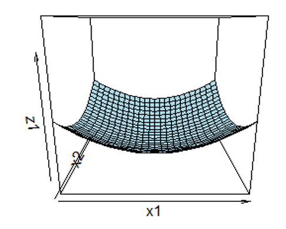
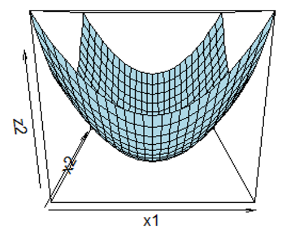

layout: true

.footnote[U.S. Department of Commerce | National Oceanic and Atmospheric Administration | National Marine Fisheries Service]


<style type="text/css">

code.cpp{
  font-size: 14px;
}
code.r{
  font-size: 14px;
}


</style>


```{r setup, include=FALSE}
options(htmltools.dir.version = FALSE)
```

```{r xaringan-tile-view, echo=FALSE}
# this gives you a tile navigation if you type "O" at any time
xaringanExtra::use_tile_view()
```
<!-- modified from Cole Monnahan's TMB training series:  https://github.com/colemonnahan/tmb_workshop-->


---
# Where to get everything


.column-60[
```{r, echo = FALSE, out.width="100%", fig.align="left"}
knitr::include_graphics("static/tmb_training_screenshot.png")
```
]

.column-40[
All slides and code are at:<br> [NOAA-FIMS/TMB_training](https://github.com/NOAA-FIMS/TMB_training)
```{r, echo = FALSE, out.width="90%", fig.align="left"}
knitr::include_graphics("static/SessionI_screenshot.png")
```
]
---
# Session I Agenda
<br>

**Day 1**:<br>
- Review of statistical computing with TMB
- TMB Basics with Linear Regression live coding example
- Debugging 
<br>

**Day 2**:<br>
- Dealing with parameters
- Modular TMB with Multinomial live coding example
- Debugging 

 
---
# Statistical Computing Review
<br>

```{r, echo = FALSE, out.width="60%", fig.align="left"}

```


---
# What is AD?

.three-column-left[
**Automatic Differentiation**<br>
Derivatives calculated automatically using the chain rule<br>
.p[
- Efficient: forward mode, O(n); reverse mode, O(m)
- Accurate 
- Higher order derivatives: easy
]]
.three-column-left[
**Symbolic Differentiation**<br>
Computer program converts function into exact derivative function<br>
.p[
- Inefficient: O(2n) for n input variables
- Exact 
- Higher order derivatives: difficult due to complexity
]]
.three-column-left[
**Numerical Differentiation**<br>
Approximation that relies on finite differences
.p[
- Efficient: O(n) 
- Trade-off between truncation error versus round-off error
- Higher order derivatives calculation difficult due to error accumulation
]]

---
# Computational Graph (Tape)
<br>
.three-column-left[
```{Rcpp, eval = FALSE}
//Program
v1: x = ?
v2: y = ?
v3: a = x * y
v4: b = sin(y)
v5: z = a + b
```
]
.three-column[
```{r, echo = FALSE, out.width="100%", fig.align="left"}
knitr::include_graphics("static/comp-graph.png")
```
]
.three-column-left[
```{Rcpp, eval = FALSE}
//Reverse Mode
dz = ?
da = dz
db = dz
dx = yda
dy = xda + cos(y)db
```
]

---
# Reverse Mode
.pull-left[
**Static (TMB: CppAD, TMBad)**<br>
The graph is constructed once before execution
.p[
- Less flexibility with conditional statements that depend on parameters. 
- Atomic functions can be used when conditional statements depend on parameters
- High portability 
- Graph optimization possible
]]

.pull-right[
**Dynamic (Stan: Stan Math Library, ADMB: AUTODIF)**<br>
The graph is defined as forward computation is executed at every iteration
.p[
- Flexibility with conditional statements
- Optimization routine implemented into executable
- Less time for graph optimization
]
]

---

class: middle

# Type Systems in R and C++
---
# Dynamic vs. Static Typing
<br>
.pull-left[
**R: Dynamic**
.p[
- Type checking occurs at run time
- The values and types associated with names can change
- Change in type tends to be implicit
]]

.pull-right[
**C++: Static**
.p[
- Type checking occurs at compile time
- The values associated with a given name can be limited to just a few types and may be unchangeable
- Change in type tends to be explicit
]]

---
# Changing Type Declaration
<br>
.pull-left[
**R: Dynamic**
```{r}
a <- 1
a <- "hello"
a <- function(x) x^2
a <- environment()
```

```{r, echo = FALSE}
foo <- `+`
```

```{r}
`+`  <- `-`
1 + 1
```

```{r, echo = FALSE}
`+` <- foo
rm(foo)
```
]

.pull-right[
**C++: Static**
```{Rcpp, eval = FALSE}
#include <iostream>
#include <string>

int main() {
    double a = 1.1;
    std::string a = "hello";
    return 0;
}
```

```{bash, eval = FALSE}
g++ ../src/lec1a.cpp -o a.exe
```
error in engine(options) : lec1a.cpp: In function 'int main()': lec1a.cpp:7:17: error: **conflicting declaration**
]

---
# Explicit Type Conversion
<br>
.pull-left[
**R: Dynamic**
```{r, eval = FALSE}
a <- 1
b <- "hello"
a + b
```
Error in a + b : non-numeric argument to binary operator

```{r}
a <- 1
b <- "hello"
c <- as.numeric(as.factor(b))
a + c
```
] 

.pull-right[
**C++: Static**
```{Rcpp, eval = FALSE}
#include <iostream>
#include <string>

int main() {
    int x = 1;
    std::string a = "a";
    std::string b = std::to_string(x);
    std::cout << a + b;
    return 0;
}
```

```{bash, eval = FALSE}
g++ ../src/lec1b.cpp -o b.exe
b.exe
```
a1
]
---
# Implicit Type Conversion
.pull-left[
**R: Dynamic**
```{r}
a <- 1
b <- "hello"
c(a,b)
```
]

.pull-right[
**C++: Static**
```{Rcpp, eval = FALSE}
#include <iostream>
#include <string>

int main() {
    double x = 1.1;
    int y = x;
    std::cout << "x = " << x << "; y = " << y << std::endl;
    return 0;
}
```

```{bash, eval = FALSE}
g++ ../src/lec1c.cpp -o c.exe
c.exe
```
x = 1.1; y = 1 
]


---
# What is Templated C++?
<br><br>
* Generic programming
* Allows developer to write functions and classes that are independent of Type
* Templates are expanded at compile time

.pull-left[
```{Rcpp, eval = FALSE}

template <class T>
  T add(T x, T y){
  return x + y;
}

int main(){
  int a = 1;
  int b = 2;
  double c = 1.1;
  double d = 2.1;
  int d = add(a,b);
  double e = add(c,d);
}

```
]
.pull-right[
```{Rcpp, eval = FALSE}
int add(int x, int y){
  return x + y;
}
double add(double x, double y){
  return x + y;
}
```
]

---
# Setting up Templated C++
<br>
```{Rcpp, eval = FALSE}
template <class T>
T add(T x, T y){
  return x + y;
}
```
<br>
```{Rcpp, eval = FALSE}
template <typename Type>
Type add(Type x, Type y){
  return x + y;
}
```

---
# TMB AD Systems
<br>
.pull-left[
**CppAD**
- [CppAD package](https://coin-or.github.io/CppAD/doc/cppad.htm)
]
.pull-right[
**TMBad**<br>
- TMBad is available with TMB 1.8.0 and higher
]

---
# TMB AD Types

**CppAD**<br>
From [FIMS/inst/include/def.hpp](https://github.com/NOAA-FIMS/FIMS/blob/24458ce4cae439dbb4917a013a35cac5cc11b592/inst/include/common/def.hpp#L17)

```{Rcpp, eval = FALSE}
#ifdef TMB_MODEL
// simplify access to singletons
#define TMB_FIMS_REAL_TYPE double
#define TMB_FIMS_FIRST_ORDER AD<TMB_FIMS_REAL_TYPE>
#define TMB_FIMS_SECOND_ORDER AD<TMB_FIMS_FIRST_ORDER>
#define TMB_FIMS_THIRD_ORDER AD<TMB_FIMS_SECOND_ORDER>
#endif
```

def                                            |CppAD Type                    |Value           |Used to evaluate
-----------------------------------------------|----------------------------|-----------------------------------------
TMB_FIMS_REAL_TYPE double                      | < double >                 | likelihood     |
TMB_FIMS_FIRST_ORDER AD<TMB_FIMS_REAL_TYPE>    | AD < double >              | 1st derivative | MLE
TMB_FIMS_SECOND_ORDER AD<TMB_FIMS_FIRST_ORDER> | AD< AD < double > >        | 2nd derivative | Variance
TMB_FIMS_THIRD_ORDER AD<TMB_FIMS_SECOND_ORDER> | AD< AD< AD < double > > >  | 3rd derivative | Laplace approximation


---
# TMB AD Types

.pull-left-wide[
**CppAD**<br>

```{Rcpp, eval = FALSE}
#ifdef TMB_MODEL
// simplify access to singletons
#define TMB_FIMS_REAL_TYPE double
#define TMB_FIMS_FIRST_ORDER AD<TMB_FIMS_REAL_TYPE>
#define TMB_FIMS_SECOND_ORDER AD<TMB_FIMS_FIRST_ORDER>
#define TMB_FIMS_THIRD_ORDER AD<TMB_FIMS_SECOND_ORDER>
#endif
```
]
.pull-right-narrow[
**TMBad**<br>
```{Rcpp, eval = FALSE}
#ifdef TMB_MODEL
#ifdef TMBAD_FRAMEWORK
#define TMBAD_TYPE TMBad::ad_aug 
#endif
#endif
```
]


<br>
**TMBad is available with TMB 1.8.0 and higher**
---
class: middle

# Likelihood Review
---
# ML Inference

What is the likelihood for 30 successes in 100 trials?

.pull-left[
1. **Specify the model** <br><br>
$y ~ \sim Binomial(n, p)$
]
---
# ML Inference

What is the likelihood for 30 successes in 100 trials?

.pull-left[
1. Specify the model
2. **Calculate the likelihood**<br><br>
$L(p; n, y) = \frac{n!}{y!(n-y)!}p^y(1-p)^{n-y}$
]

.pull-right[
$L(p; n = 100, y = 30)$
```{r, eval=TRUE, out.width = '80%', echo = FALSE}
curve(dbinom(30,100,x),0,0.75, ylab = 'L(p)', xlab = 'p')
```
]
---

# ML Inference

What is the likelihood for 30 successes in 100 trials?

.pull-left[
1. Specify the model
2. Calculate the likelihood
3. **Calculate the negative log-likelihood**<br><br>
$-\ell(p; n, y) = -[ln\big(\frac{n!}{y!(n-y)!}\big) + yln(p)$<br>
     $$+ (n-y)ln(1-p)]$$
]

.pull-right[
$-ln\big[L(p; n = 100, y = 30)\big]$
```{r, eval=TRUE, out.width = '80%', echo = FALSE}
curve(-log(dbinom(30,100,x)),0,0.75, ylab = 'l(p)', xlab = 'p')
```
]
---

# ML Inference

What is the likelihood for 30 successes in 100 trials?

.pull-left[
1. Specify the model
2. Calculate the likelihood
3. Calculate the negative log-likelihood
$-\ell(p; n, y) = -[ln\big(\frac{n!}{y!(n-y)!}\big) + yln(p)$<br>
     $$+ (n-y)ln(1-p)]$$
4. **Calculate the derivative w.r.t. $p$**<br><br>
$\frac{d(\ell(p; n, y))}{dp} = \frac{y}{p}- \frac{n-y}{1-p}$
]

.pull-right[
$-ln\big[L(p; n = 100, y = 30)\big]$
```{r, eval=TRUE, out.width = '80%', echo = FALSE}
curve(-log(dbinom(30,100,x)),0,0.75, ylab = 'l(p)', xlab = 'p')
```
]
---

# ML Inference

What is the likelihood for 30 successes in 100 trials?

.pull-left[
1. Specify the model
2. Calculate the likelihood
3. Calculate the negative log-likelihood
4. Calculate the derivate wrt p
5. **Set to 0 and solve for MLE**<br>
$0 = \frac{y}{p}- \frac{n-y}{1-p}$ <br>
$E[p] = \frac{y}{n}$<br>
$E[y] = np$
]

.pull-right[
$-ln\big[L(p; N = 100, y = 30)\big]$
```{r, eval=TRUE, out.width = '70%', echo = FALSE}
curve(-log(dbinom(30,100,x)),0,0.75, ylab = 'l(p)', xlab = 'p')
nll <- -dbinom(30,100,.3,TRUE)
segments(0.1, nll, 0.5, nll, col='red', lwd=2)
```
<br>
$\hat{p} = \frac{30}{100} = 0.3$
]

---

# ML Inference

What is the likelihood for 30 successes in 100 trials?

.pull-left[
1. Specify the model
2. Calculate the likelihood
3. Calculate the negative log-likelihood
4. Calculate the derivate wrt p
5. Set to 0 and solve for MLE<br>
$0 = \frac{y}{p}- \frac{n-y}{1-p}$ <br>
$E[y] = np$
6. **Approximate Var[p] using the second derivative**<br>
$-\frac{y}{p^2} - \frac{(n-y)}{(1-p)^2}$<br>
$-\frac{np}{p^2} - \frac{(n-np)}{(1-p)^2}$<br>
$-\frac{n}{p} - \frac{n(1-p)}{1-p}$<br>
$l''(p) = -\frac{n(1-p)}{p}$<br>
$Var[p] = \frac{p}{n(1-p)}$
]

.pull-right[
$Var[p] \approx -\frac{1}{l''(p)}$<br>
$SE[p] \approx \sqrt{ \frac{.3}{100(.7)}} \approx 0.065$<br>
```{r, eval=TRUE, out.width = '70%', echo = FALSE}
curve(-log(dbinom(30,100,x)),0,0.75, ylab = 'l(p)', xlab = 'p')
nll <- -dbinom(30,100,.3,TRUE)
points(0.3, nll, col = 'red')
confint <- .3 + c(-1,1)*2*sqrt(.3/70)
segments(confint[1], -log(dbinom(30,100,confint[1])), confint[1], 100, col='red', lwd=2)
segments(confint[2], -log(dbinom(30,100,confint[2])), confint[2], 100, col='red', lwd=2)
text(.3, 20, "95% confint", col='red', cex = 2)
```
]
---
#Multivariate asymptotics

* For N-d models, the curvature is represented by a NxN **Hessian** matrix of 2nd partial derivatives
* Inverting the negative Hessian gives us a covariance matrix

\begin{align}
(\mathbb{H}_{f})_{i,j} &= \frac{\partial^2f}{\partial \theta_{i}, \partial x\theta_{j}} = \frac{-1}{Var(\Theta)}
\end{align}

.three-column[

]
.three-column[<br><br>Which will have the smaller SE?]
.three-column[

]
---
class: middle

# Hierarchical modeling with TMB

---
#The Hierarchical model<br><br><br>

$$\Large \int_{\mathbb{R}}f(y;u,\theta)f(u;\theta)du$$
---
# The Laplace approximation<br>

Changes the problem from integration to optimization <br>
.pull-left[
$$L(\theta) = \int_{\mathbb{R}}f(y;u,\theta)f(u;\theta)du$$<br><br>
$$L^{*}(\theta) = \sqrt{2\pi}^{n}det(\mathbb{H})^{-1/2}f(y,\hat{u}, \theta)$$
]
.pull-right[
```{r, echo = FALSE, out.width="100%", fig.align="left"}
knitr::include_graphics("static/laplace-accuracy.png")
```
<br>
Figure from [Albertsen, C. M. (2018), 2.3.1](https://backend.orbit.dtu.dk/ws/portalfiles/portal/157133664/Publishers_version.pdf)
]
---
# The Laplace approximation<br>

Changes the problem from integration to optimization <br>
.pull-left[
$$L(\theta) = \int_{\mathbb{R}}f(y;u,\theta)f(u;\theta)du$$<br><br>
$$L^{*}(\theta) = \sqrt{2\pi}^{n}det(\mathbb{H})^{-1/2}f(y,\hat{u}, \theta)$$<br><br>
$$d'(l^{*}) = d'(logdet(\mathbb{H})^{-1/2}) + d'(log(f(y,\hat{u}, \theta)))$$
]
.pull-right[
```{r, echo = FALSE, out.width="100%", fig.align="left"}
knitr::include_graphics("static/laplace-accuracy.png")
```
<br>
Figure from [Albertsen, C. M. (2018), 2.3.1](https://backend.orbit.dtu.dk/ws/portalfiles/portal/157133664/Publishers_version.pdf)
]
---

# Review of TMB::CppAD Types
<br>


def                                            |CppAD Type                    |Value             |Used to evaluate
-----------------------------------------------|----------------------------|--------------------------------------
TMB_FIMS_REAL_TYPE double                      | < double >                 | $l^{*}(\theta)$  |
TMB_FIMS_FIRST_ORDER AD<TMB_FIMS_REAL_TYPE>    | AD < double >              | $\approx 0$      | MLE
TMB_FIMS_SECOND_ORDER AD<TMB_FIMS_FIRST_ORDER> | AD< AD < double > >        | $\mathbb{H}$     | Variance, Laplace
TMB_FIMS_THIRD_ORDER AD<TMB_FIMS_SECOND_ORDER> | AD< AD< AD < double > > >  | $d'(\mathbb{H})$ | Laplace 

---
# TMB and FIMS
[**fimsflow**](https://docs.google.com/presentation/d/1U8N6J6YQIdd0Wer-o5vZvGTHgw1GLA8_6a0r8sYfqXo/edit#slide=id.g13fa6bc6e99_0_0)
```{r, echo = FALSE, out.width="60%", fig.align="left"}
knitr::include_graphics("static/fims-tmb1.png")
```
---
# TMB and FIMS
[**fimsflow**](https://docs.google.com/presentation/d/1U8N6J6YQIdd0Wer-o5vZvGTHgw1GLA8_6a0r8sYfqXo/edit#slide=id.g1405a9bb7f8_0_0)
```{r, echo = FALSE, out.width="80%", fig.align="left"}
knitr::include_graphics("static/fims-tmb2.png")
```
