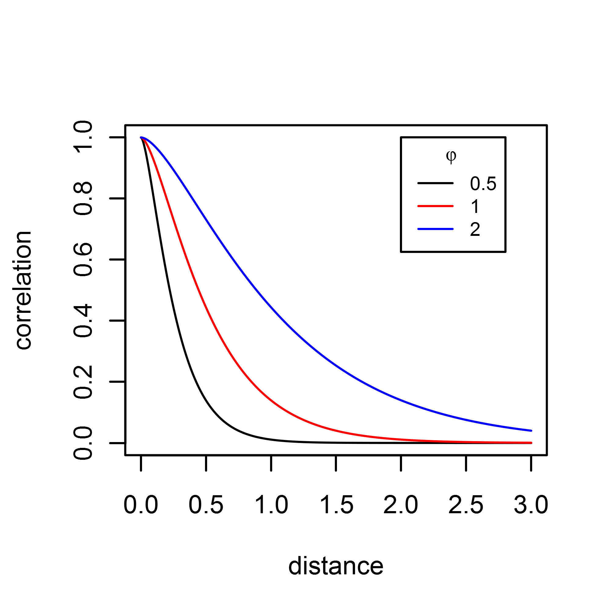
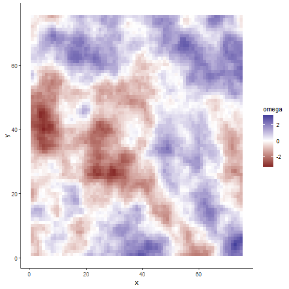
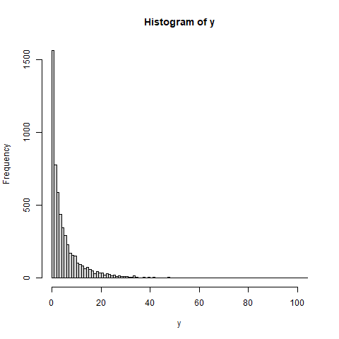
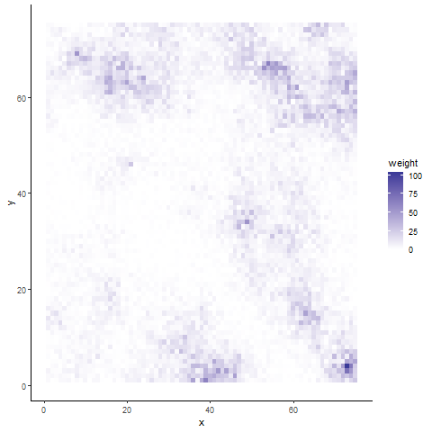
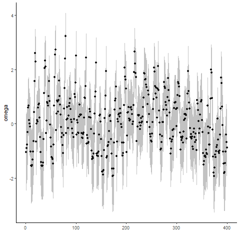
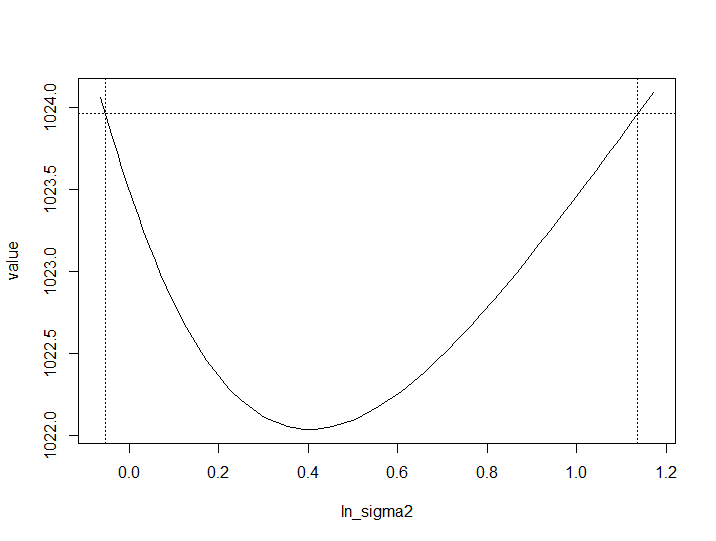
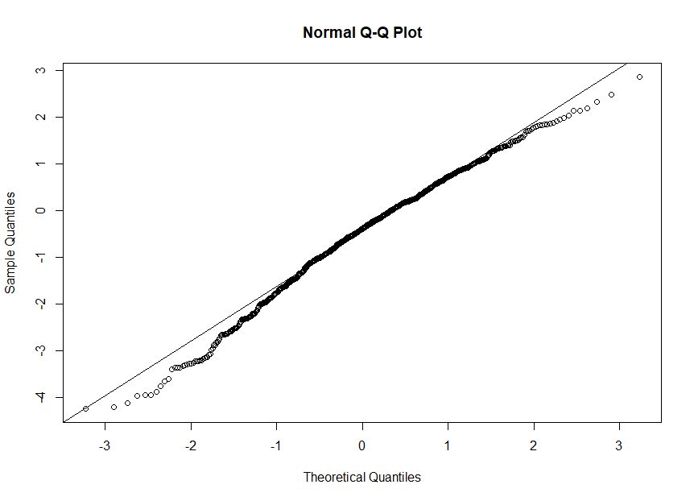

layout: true

.footnote[U.S. Department of Commerce | National Oceanic and Atmospheric Administration | National Marine Fisheries Service]


<style type="text/css">

code.cpp{
  font-size: 14px;
}
code.r{
  font-size: 14px;
}


</style>


```{r setup, include=FALSE}
options(htmltools.dir.version = FALSE)
```

```{r xaringan-tile-view, echo=FALSE}
# this gives you a tile navigation if you type "O" at any time
xaringanExtra::use_tile_view()
```

---
# Spatial Model via GLMM
<br>

.three-column[
For a set of species weights
\begin{align}
  y_{i} &\sim f(g^{-1}(\eta_{i})) \\
  \eta_{i} &= \beta_{0} + \omega_{i} \\
  \omega &\sim MVN(0,\Sigma) \\
  &\\
  L(\omega) &= \frac{|\Sigma|^{-1/2}}{\sqrt{(2\pi)^{n}}}exp\Big(-\frac{1}{2}\omega^{T}\Sigma^{-1}\omega\Big)\\
  &\\
  \Sigma &= \sigma^{2}_{\omega}matern(\phi, \nu=1)
\end{align}
]

.three-column[
```{r, echo = FALSE, out.width="80%", fig.align="center"}

```

]

.three-column[
```{r, echo = FALSE, out.width="85%", fig.align="left"}

```

]
---
# Tweedie distributed data
<br>

.three-column[
For a set of species weights
\begin{align}
  y_{i} &\sim Tweedie(\mu_{i}, \phi, power) \\
  \mu_{i} &= exp(\eta_{i})\\
  \eta_{i} &= \beta_{0} + \omega_{i} \\
  \omega &\sim MVN(0,\Sigma) \\
  &\\
  L(\omega) &= \frac{|\Sigma|^{-1/2}}{\sqrt{(2\pi)^{n}}}exp\Big(-\frac{1}{2}\omega^{T}\Sigma^{-1}\omega\Big)\\
  &\\
  \Sigma &= \sigma^{2}_{\omega}matern(\phi, \nu=1)
\end{align}
]

.three-column[
```{r, echo = FALSE, out.width="80%", fig.align="right"}

```
]
.three-column[
```{r, echo = FALSE, out.width="80%", fig.align="left"}

```

]
---
#Estimating Uncertainty<br><br>

Uncertainty estimates can be calculated in several ways with TMB
 * Asymptotic approximation + delta method ([TMB::sdreport](https://rdrr.io/cran/TMB/man/sdreport.html))
  - Asymptotics: <br>
  $Var[\theta] \approx -\frac{1}{l''(\theta)}$
  <br>
  - Delta Method: <br>
  $g(\theta)$: some derived function of $\theta <br>
  $Var[g(\theta)] \approx g'(\theta)^2var(\theta)$

 * Likelihood profiles ([TMB::tmbprofile](https://rdrr.io/cran/TMB/man/tmbprofile.html))

---
#TMB::sdreport
#### [TMB::as.list.sdreport](https://rdrr.io/cran/TMB/man/as.list.sdreport.html) 

.pull-left[
```{r, eval = FALSE}
sdr <- sdreport(obj)
df <- data.frame(
  omega.est = as.list(sdr, "Estimate")$omega,
  omega.se = as.list(sdr, "Std. Error")$omega,
  conf.lower = omega.est - qnorm(.975)*omega.se,
  conf.upper = omega.est + qnorm(.975)*omega.se)
ggplot(df, aes(x = 1:400, y = omega.est)) +
  geom_point() +
  geom_ribbon(aes(x = 1:400, ymin = conf.lower, 
                  ymax = conf.upper, fill = "band"), 
              alpha = 0.3) +
  scale_fill_manual("", values = "grey20") +
  ylab("omega") + xlab("") +
  theme_classic() + 
  theme(legend.position = "none")
```
]

.pull-right[
```{r, echo = FALSE, out.width="75%", fig.align="left"}

```

]
---
# Lkelihood Profiles
<br>
.pull-left[
* Does not make the asymptotic normal assumption
* Refit model at series of fixed values for parameter of interest 
* Calculate likelihood ratio tests between optimum and re-evaluated likelihoods
* The 95% LRCI is the point at which the log-likelihoods decreases by 1.92
* A good (but slower) approach that works better when likelihood profile is asymmetric
\begin{align}
LRT &\sim \chi^2_{df=1, 0.95}\\ 
\chi^{2}_{1,0.95} &\approx 3.84\\
3.84/2 &= 1.92
\end{align}
]
.pull-right[
```{r, echo = FALSE, out.width="100%", fig.align="left"}
knitr::include_graphics("static/millar-profile.png")
```
.small[source: Millar, R.B. 2011. Maximum likelihood estimation and inference, pg. 59]
]

---
# Likelihood Profiles
<br>
.pull-left[
* Easy to do in TMB: 
```{r, eval = FALSE}
#profile beta0
prof <- TMB::tmbprofile(obj, "ln_sigma2")
plot(prof)
confint(prof)
```
* plot(prof) and confint(prof) plot and give 95% range
* This interval may not be symmmetic nor finite
]
.pull-right[
```{r, echo = FALSE, out.width="100%", fig.align="center"}

```
]

---

#Checking the Laplace Approximation
* For mixed effects models, TMB allows one to test whether the the Laplace approximation of the marginal log-likelihood and joint log-likelihood is ok.

\begin{align}
E [\nabla_{θ}f(y,u;\theta)] = 0\\
E [\nabla_{θ}  \int f(y,u))du ] = 0
\end{align}
* Simulate data and calculate gradients $(\nabla_{\theta})$ for each simulated data set
* Average gradient should be $0$ when the Laplace approximation is ok
```{r, eval = FALSE}
check <- TMB::checkConsistency(obj)
summary(check)
```
* performs $\chi^2$ test for gradient bias for marginal and joint
* provides estimates of bias for fixed effects parameters
* increasing sample sizes will increase power of $\chi^2$ test for (small) bias 
---

# Quantile Residuals<br>


* TMB's **oneStepPredict()** function steps through the data calculating quantile residuals for observation $i$ given all previous observations:

.pull-left[<br>
$r_{i} = \phi^{-1}(F(Y_{i}|Y_{1},\ldots, Y_{i-1},\Theta))$<br>

$\phi^{-1}$: inverse cdf of the standard normal<br>

$F(Y,\Theta)$: cdf of $f(Y,\Theta)$

* These residuals are independent standard normal when the model is appropriate for the data

* For non-random effects models these are equivalent to more familiar quantile residuals used with GLMs because
$F(Y_{i}|Y_{1},\ldots, Y_{i-1},\Theta) = F(Y_{i}|\Theta)$

]

.pull-right[

]
---
# TMB OSA methods<br><br>

```{r, echo = FALSE}
mat <- rbind(
  c("FullGaussian", "Best approach when data and random effects are both normally distributed"),
  c("oneStepGaussian", "Most efficient one-step method when data and random effects are approximately normal" ),
  c("cdf", "One-step method that does not require normality but does require a closed form cdf"),
  c("oneStepGeneric", "One-step method useful when no closed form cdf but slow")
)
df <- as.data.frame(mat)
colnames(mat) <- c('Method', 'Definition')
knitr::kable(as.data.frame(mat))

```
* The cdf and oneStepGeneric methods are the only methods available for discrete data: randomized quantile residuals
* oneStepGeneric is dependent on Laplace approximations of likelihoods, so probably important to use TMB::checkConsistency.
* OSA residuals are challenging for some distributions (eg. delta-lognormal, tweedie). 

---
# Implementing OSA in TMB<br>

.pull-left[
```cpp
  DATA_VECTOR(Y); //number mature
  DATA_VECTOR_INDICATOR(keep, Y); // for OSA residuals
  DATA_VECTOR(N); //number of mature + not mature
  DATA_VECTOR(age_obs); //age for each observation
  DATA_IVECTOR(re_ind); //indicator for random effect for each observation
  DATA_INTEGER(max_age); //to generate a maturity ogive
  PARAMETER_VECTOR(beta); //intercept, slope
  PARAMETER(log_phi);
  PARAMETER_VECTOR(AR_pars); //AR1 process (2 pars)
  PARAMETER_VECTOR(re); //annual ar1 process

...

  Type nll_re = SCALE(AR1(rho_re), sig_re)(re); //NEGATIVE log-likelihood returned....

...

  for(int i = 0; i < n_obs; i++) {
    logit_mat(i) = beta(0)  + beta(1)*age_obs(i) + re(re_ind(i)); 
    mat(i) = 1/(1 + exp(-logit_mat(i)));
    nll(i) = -keep(i) * dbetabinom(Y(i), N(i), mat(i), phi, 1); //negative log-likelihood
  }
  
  ...
  
  return sum(nll) + nll_re;
}

```
]

.pull-right[
```{r, eval = FALSE}
mod = MakeADFun(inputosa$data, inputosa$par, random = "re", DLL = "maturity_bb_re_osa")
opt <- nlminb(mod$par, mod$fn, mod$gr)

residuals = oneStepPredict(mod, 
  observation.name = "Y", 
  data.term.indicator="keep", 
  method = "oneStepGeneric", 
  discrete=TRUE)
plot(input$data$age_obs, residuals$residual)
qqnorm(residuals$residual)
qqline(residuals$residual)
```
```{r, echo = FALSE, out.width="60%", fig.align="center"}

```
* See [maturity_bb_re_osa.cpp](https://github.com/NOAA-FIMS/TMB_training/blob/main/maturity_examples/maturity_bb_re_osa.cpp)
* [maturity_bb_re.R](https://github.com/NOAA-FIMS/TMB_training/blob/main/maturity_examples/maturity_bb_re.R)
]

---
# Gradient checking <br>

* Optimizer may finish with some gradient components with larger (absolute) values than we would like.
* For example, suppose we wish to ensure the maximum absolute gradient is < 1e-6
* But doing some Newton steps usually ratchets down the gradient to palatable levels

.pull-left[
```{r eval = FALSE}
mod = MakeADFun(input$data, input$par, random = "re", DLL = "maturity_bb_re_density")
opt2 = nlminb(mod$par, mod$fn, mod$gr)
#same results (more or less)
#max gradient is not great
sdreport(mod)
max(abs(mod$gr(opt2$par)))
iter: 1  mgc: 5.406591e-10 
outer mgc:  0.01812217 
[1] 0.01812217
parbad = opt2$par
```
* See [maturity_bb_re.R](https://github.com/NOAA-FIMS/TMB_training/blob/main/maturity_examples/maturity_bb_re.R)
] 

.pull-right[
```{r eval = FALSE}
# Take a few extra newton steps
for(i in 1:3){
  g <- as.numeric(mod$gr(opt2$par))
  h <- stats::optimHess(opt2$par, mod$fn, mod$gr)
  opt2$par <- opt2$par - solve(h, g)
  opt2$objective <- mod$fn(opt2$par)
}
max(abs(mod$gr(opt2$par)))
iter: 1  value: 1476.141 mgc: 3.900766e-08 ustep: 1 
mgc: 1.086242e-12 
outer mgc:  1.51557e-07 
[1] 1.51557e-07
parbad - opt2$par
         beta          beta       log_phi       AR_pars       AR_pars 
-3.620056e-05  4.722279e-07  9.880448e-05 -7.818749e-06 -1.854744e-07 
```
]

---
class: middle

# Extra slides

---
##Asymptotic approximation with $f''$

The second derivative measures the curvature of the likelihood and is approximately equal to the negative inverse of the variance when evaluated at the MLE

Poisson Likelihood: $f(y) = \frac{e^{-\lambda}\lambda^{y}}{y!}$, for **y = 2**:
.three-column[
log-likelihood: 


$\small \ell(\lambda) = -\lambda + ylog(\lambda) - log(y!)$
```{r echo = FALSE}
curve(log(dpois(2,x)), xlab = expression(lambda), ylab = expression("l("~ lambda ~ "|y=2)"),0,5, cex.lab = 1.5)
```

]

.three-column[
1st derivative: 

$\frac{d\ell(\lambda)}{d\lambda} = -n + \frac{y}{\lambda}$
```{r echo = FALSE}
pois.1d <- function(x,y){-1 + y/x}
curve(pois.1d(x,2), xlab = expression(lambda), ylab = expression("l("~ lambda ~ "|y=2)'"),0,5, cex.lab = 1.5)
```
$\frac{\hat{y}}{n} = \lambda$
]

.three-column[
2nd Derivative: 

$\frac{d^{2}\ell(\lambda)}{d\lambda^{2}} = -\frac{y}{\lambda^{2}}$

Evaluated at the MLE:
$$-\frac{n\lambda}{\lambda^{2}} = -\frac{n}{\lambda}$$
$$Var(\lambda) = \frac{\lambda}{n}$$

]


---
#Asymptotics in TMB<br><br>

* Hessian is hard to calculate
* TMB uses AD 
```{r, eval = FALSE}
mod$he
```
* This can be accessed with:
```{r, eval = FALSE}
summary(sdreport(mod), 'fixed')
fit.cov <- sdreport(mod)$cov.fixed
ses <- sqrt(diag(fit.cov))
```

* Under these assumptions we create a confidence interval as MLE +/- 1.96*SE

---
##Uncertainity for derived quantities<br><br>

* Inverting the Hessian only works for parameters

* We often want uncertainty for functions of parameters (‘derived quantities’)

* In the maturity at age model, we want to know the uncertainty of $a50$

* We know the SE for $\beta_{0}$ and $\beta_{1}$ from the inverted Hessian (it is a parameter)

* We also know that $a50 = -\beta_{0}/\beta_{1}$

* We can use the **Delta method** to calculate $Var(a50)$ 

---
#Delta method<br>

Univariate Delta method:
$$Var[g(\theta)] \approx g'(\theta)^2var(\theta)$$
Multivariate Delta method:
$$Var[g(\Theta)] \approx G(\Theta)Var(\Theta)G(\Theta)$$

where $G(\Theta)$ is the Jacobian matrix of partial 1st derivatives
<br>

TMB calculates the multivariate Delta method automatically:
.pull-left[
```cpp
Type a50 = -beta(0) / beta(1);
ADREPORT(a50);
```
]
.pull-right[
```{r, eval = FALSE}
sdr <- sdreport(mod)
summary(sdr, 'report')
```
]
