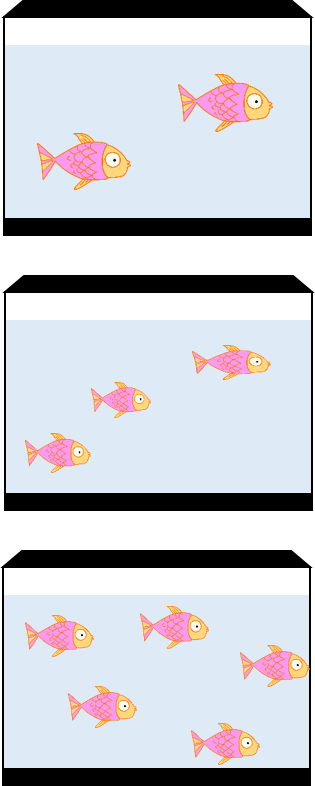
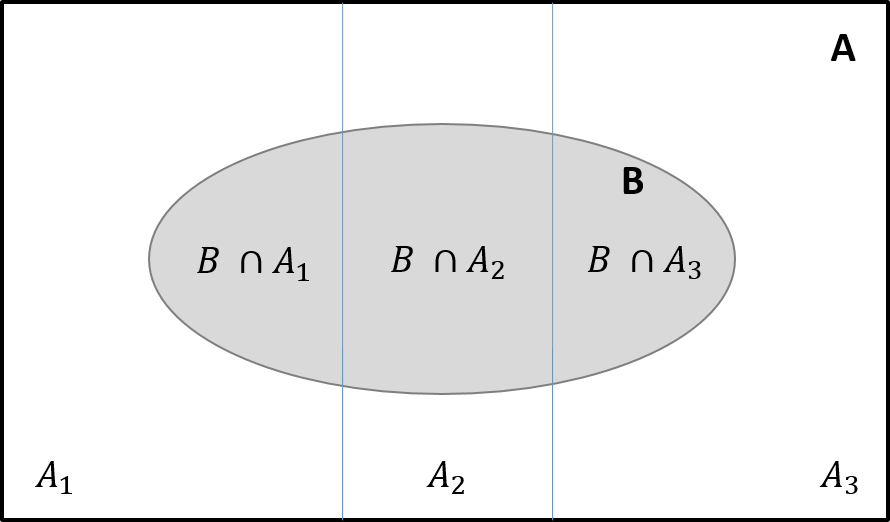

layout: true

.footnote[U.S. Department of Commerce | National Oceanic and Atmospheric Administration | National Marine Fisheries Service]


<style type="text/css">

code.cpp{
  font-size: 14px;
}
code.r{
  font-size: 14px;
}


</style>


```{r setup, include=FALSE}
options(htmltools.dir.version = FALSE)
```

```{r xaringan-tile-view, echo=FALSE}
# this gives you a tile navigation if you type "O" at any time
xaringanExtra::use_tile_view()
```

---
# Where to get everything


.column-60[
```{r, echo = FALSE, out.width="100%", fig.align="left"}
knitr::include_graphics("static/tmb_training_screenshot.png")
```
]

.column-40[
All slides and code are at:<br> [NOAA-FIMS/TMB_training](https://github.com/NOAA-FIMS/TMB_training)
```{r, echo = FALSE, out.width="90%", fig.align="left"}
knitr::include_graphics("static/SessionII_screenshot.png")
```
]
---
# Session II Agenda
<br>

**Day 1**:<br>
- Review of Latent Variable Models
- AR1 Process and Sparsity
- C++ Review
<br>

**Day 2**:<br>
- Uncertainty and Bias Correction
- Model Validation
- Modular TMB 

 
---
# Latent Variable Models

.p[
Data originate from a process with multiple sources of variability, not all of which are observable
- Causes:
  - Unobserved variability caused by grouping structure
  - Unobserved spatial and/or temporal process
- Statistical consequence: 
  - Data are not iid
- Includes: 
  - mixed-effects models
  - random-effects models
  - hierarchical models
  - state-space models
]

---
# Fixed versus Random Effects


.pull-left[
<br>
y = swim speed <br>
$\eta = \beta0 + \beta_{1} temp + \beta_{tank}$
```{r, echo = FALSE}
library(knitr)
library(kableExtra)
tbl <- data.frame(
  "Linear" = 
    c('$y \\sim Normal(\\eta, \\sigma)$',
      "$y|tank \\sim Normal(\\eta, \\sigma_{y})$ $tank \\sim Normal(0, \\sigma_{RE})$"),
  "Generalized Linear" = 
    c("$y \\sim Gamma(1/CV, \\eta CV)$",
      "$y|tank \\sim Gamma(1/CV, \\eta CV)$ $tank \\sim Normal(0, \\sigma_{RE})$")
)
row.names(tbl) <- c("FE Model", "Mixed Model")
kable(tbl, escape = FALSE)
```
]

.pull-right-narrow[
```{r, echo = FALSE, out.width="60%", fig.align="left"}

```
]
---
## Joint, Conditional, and Marginal Probability
.pull-left[
<br>
**Joint Probability**: $$P(A\cap B) = P(A,B)$$

]

.pull-right[
```{r, echo = FALSE}
library(ggVennDiagram)
library(ggplot2)
set.seed(1)
C <- diag(2)
C[1,2] <- C[2,1] <- 0.7
obs <- mvtnorm::rmvnorm(1000, c(0,0), sigma=C)
x <- list(A = obs[,1], B = obs[,2])
venn <- Venn(x)
dat <- process_data(venn)
venn.reg <- venn_region(dat)
venn.reg$fill <- c(1,2,3)
ggplot() + 
  geom_sf(aes(fill = fill), data = venn.reg) +
  geom_sf(aes(color = id), data = venn_setedge(dat)) +
  geom_sf_text(aes(label = name), fontface = "bold", size = 8, 
               data = venn_setlabel(dat)) +
  theme_void() + 
  theme(legend.position = "none") + 
  scale_fill_gradient(low = "grey90", high = "gray20") + 
  scale_color_manual(values = rep("black",2))
```
]

---
## Joint, Conditional, and Marginal Probability
.pull-left[
<br>
**Joint Probability**: $$P(A\cap B) = P(A,B)$$<br>

**Marginal Probability**: $$P(B)$$

]

.pull-right[
```{r, echo = FALSE}
library(ggVennDiagram)
library(ggplot2)
set.seed(1)
C <- diag(2)
C[1,2] <- C[2,1] <- 0.7
obs <- mvtnorm::rmvnorm(1000, c(0,0), sigma=C)
x <- list(A = obs[,1], B = obs[,2])
venn <- Venn(x)
dat <- process_data(venn)
venn.reg <- venn_region(dat)
venn.reg$fill <- c(1,2,2)
ggplot() + 
  geom_sf(aes(fill = fill), data = venn.reg) +
  geom_sf(aes(color = id), data = venn_setedge(dat)) +
  geom_sf_text(aes(label = name), fontface = "bold", size = 8, 
               data = venn_setlabel(dat)) +
  theme_void() + 
  theme(legend.position = "none") + 
  scale_fill_gradient(low = "white",high = "grey90") + 
  scale_color_manual(values = c("white","black"))
```
]

---
## Joint, Conditional, and Marginal Probability
.pull-left[
<br>
**Joint Probability**: $$P(A\cap B) = P(A,B)$$<br>

**Marginal Probability**: $$P(B)$$<br>

**Conditional Probability**: $$P(A|B)$$<br>

$$P(A|B) = \frac{P(A,B)}{P(B)}$$

]

.pull-right[
```{r, echo = FALSE}
library(ggVennDiagram)
library(ggplot2)
set.seed(1)
C <- diag(2)
C[1,2] <- C[2,1] <- 0.7
obs <- mvtnorm::rmvnorm(1000, c(0,0), sigma=C)
x <- list(A = obs[,1], B = obs[,2])
venn <- Venn(x)
dat <- process_data(venn)
venn.reg <- venn_region(dat)
venn.reg$fill <- c(1,2,3)
ggplot() + 
  geom_sf(aes(fill = fill), data = venn.reg) +
  geom_sf(aes(color = id), data = venn_setedge(dat)) +
  geom_sf_text(aes(label = name), fontface = "bold", size = 8, 
               data = venn_setlabel(dat)) +
  theme_void() + 
  theme(legend.position = "none") + 
  scale_fill_gradient(low = "white" , high = "grey70") + 
  scale_color_manual(values = c("white", "black",2))
```
]
---
# Continuous examples
<br>

.pull-left[
**Joint density** $$f(A,B)$$
]

.pull-right[
```{r, echo = FALSE, out.width="90%", fig.align="left"}
library(ggExtra)

df <- data.frame(x = obs[,1], y = obs[,2])

p <- ggplot(df, aes(x = x, y = y)) + geom_point() +  
  theme_bw() + 
  theme(legend.position = "none") + ylab("A") + xlab("B")

p
```
]

---
# Continuous examples
<br>

.pull-left[
**Joint density** $$f(A,B)$$
**Marginal density** $$f(A)$$
]

.pull-right[
```{r, echo = FALSE, out.width="90%", fig.align="left"}
library(ggExtra)

df <- data.frame(x = obs[,1], y = obs[,2])

p <- ggplot(df, aes(x = x, y = y)) + geom_point() +  
  theme_bw() + 
  theme(legend.position = "none") + ylab("A") + xlab("B")

p2 <- ggMarginal(p, margins = 'y', type = "densigram") 

p2
```
]

---
# Continuous examples
<br>

.pull-left[
**Joint density** $$f(A,B)$$
**Marginal density** $$f(B)$$
**Conditional density**
$$f(A|B=b) = \frac{f(A,B)}{f(B)}$$
]

.pull-right[
```{r, echo = FALSE, out.width="90%", fig.align="left"}
library(ggExtra)

df <- data.frame(x = obs[,1], y = obs[,2])

p <- ggplot( df[which(df$x < 1.05 & df$x > 0.95),], aes(x = x, y = y))+ geom_point() +  
  geom_point(data = df) +
  theme_bw() + 
  theme(legend.position = "none") + ylab("A") + xlab("B") + 
  geom_vline(xintercept = 1)

p2 <- ggMarginal(p, margins = 'y', type = "densigram") 

p2
```
]
---
# Marginalization - Discrete
<br>
.pull-left[
\begin{align}
P(B) &= \sum^{k}_{i=1}P(A_{i},B)\\
&= \sum^{K}_{i=1}P(B|A_{i})P(A_{i})
\end{align}
]

.pull-right[
```{r, echo = FALSE, out.width="90%", fig.align="left"}

```
]
---
# Marginalization - Continuous
<br>
.pull-left[
\begin{align}
f(B) &= \int_{\mathbb{R}} f(A,B)dA\\
&\\
&= \int_{\mathbb{R}}f(B|A)f(A)dA
\end{align}
]

.pull-right[
```{r, echo = FALSE, out.width="90%", fig.align="left"}
library(ggExtra)

df <- data.frame(x = obs[,1], y = obs[,2])

p <- ggplot(df, aes(x=x, y=y)) + geom_point() +
  theme_bw() + 
  theme(legend.position = "none") + ylab("A") + xlab("B")

p2 <- ggMarginal(p, margins = 'x', type = "densigram")

p2
```
]
---

# Likelihood of a Hierarchical Model

Data: $y$<br>
Random effect: $u$<br>
Parameters: $\Theta = (\theta_{y}, \theta_{u})$

.pull-left[
**Bayesian Inference**
\begin{align}
L(\Theta|y) &= \frac{f(y,u,\Theta)}{f(y)}\\
L(\Theta|y) &= \frac{f(y|u,\theta_{y})f(u|\theta_{u})f(\Theta)}{f(y)}\\
&\\
&= \frac{f(y|u,\theta_{y})f(u|\theta_{u})f(\Theta)}{\int_{\mathbb{R}}f(y,u,\Theta)dud\Theta}
\end{align}

- Posterior density of $\Theta$
]

.pull-right[
**MLE Inference** 
\begin{align}
L(\Theta) &= \int_{\mathbb{R}}f(y,u;\Theta)du\\
&\\
&= \int_{\mathbb{R}}f(y|u; \theta_{y})f(u;\theta_{u})du
\end{align}
<br><br>

- Point estimate of $\Theta$ with confidence intervals
]

---

# Likelihood of a Hierarchical Model

Data: $y$<br>
Random effect: $u$<br>
Parameters: $\Theta = (\theta_{y}, \theta_{u})$

.pull-left[
**Bayesian Inference**
$$L(\Theta|y) = \frac{f(y,u,\Theta)}{f(y)}$$

- Exact
 - Conjugate Priors
 - Numerical Integration
- Approximations:
 - MCMC Simulations - Metropolis Hastings, Gibbs Sampler, Hamiltonian Monte Carlo
 - Integrated Nested Laplace Approximation (INLA)
]

.pull-right[
**MLE Inference** 
$$L(\Theta) = \int_{\mathbb{R}}f(y,u;\Theta)du$$

- Exact
 - Newton-Rhapsom Algorithm
 - Expectation-Maximization Algorithm
 - Numerical integration
- Approximations:
 - Penalized Likelihood
 - Laplace approximation
 - Gauss-Hermite quadrature

]

---
# Likelihood of a Hierarchical Model

.pull-left[
**Bayesian Inference**
$$L(\Theta|y) = \frac{f(y,u,\Theta)}{f(y)}$$
]

.pull-right[
**MLE Inference** 
$$L(\Theta) = \int_{\mathbb{R}}f(y,u;\Theta)du$$

]<br>
```{r, echo = FALSE, out.width="50%", fig.align="center"}
knitr::include_graphics("static/laplace-accuracy.png")
```
<br>
Figure from [Albertsen, C. M. (2018), 2.3.1](https://backend.orbit.dtu.dk/ws/portalfiles/portal/157133664/Publishers_version.pdf)
]
---
# The Laplace approximation<br>

Changes the problem from integration to optimization <br>

The marginal likelihood of the data after integrating out random effects, $u$: 
$$L(\theta) = \int_{\mathbb{R}}f(y,u;\theta)f(u;\theta)du$$
1. The random effects likelihood is minimized to find $\hat{u}$:
$$\hat{u}(\theta) = \underset{u}{argmin}f(u,\theta)$$
2. The Hessian (matrix of partial 2nd derivatives) of $f(y,u|\theta)$ w.r.t. $u$ is evaluated at $\hat{u}(\theta)$:
$$\mathbb{H}(\theta) = f^{"}_{uu}(\hat{u}(\theta), \theta)$$
3. The Laplace approximation for the marginal likelihood is:
$$L^{*}(\theta) = \sqrt{2\pi}^{n}det(\mathbb{H})^{-1/2}f(y,\hat{u}; \theta)$$
---
# Separability

If $y_{i}$ is only dependent on $u_{i}$, then the likelihood function is **separable**

\begin{align}
L(\theta) &= \int_{\mathbb{R}^{n}}f(y,u;\theta)du\\
&= \prod^{n}_{i=1}f(y_{i}, u_{i};\theta)du
\end{align}

The marginal likelihood can be evaluated as a series of univariate Laplace approximations:
\begin{align}
L^{*}(\theta) &= \sqrt{2\pi}^{n}det(\mathbb{H})^{-1/2}f(y,\hat{u}; \theta)\\
&\\
&= \prod^{n}_{i=1}f(y_{i}, \hat{u}_{i};\theta)\sqrt{\frac{2\pi}{(-f''(y_{i},\hat{u_{i}};\theta))^{-1}}}
\end{align}

Under separability, the Hessian, $\mathbb{H}$, is sparse
---
# Sparsity

.pull-left[

Theta logistic state-space model:
\begin{align}
u_{t} &= u_{t-1} + r_{0}\bigg(1 - \Big(\frac{exp(u_{t-1})}{K}\Big)^{\psi}\bigg) \\
&\\
u_{t} &\sim N(0, \sigma_{u})\\
y_{t} &\sim N(u_{t}, \sigma_{y})
\end{align}

```{r, eval = FALSE}
TMB::runExample("thetalog", 
                exfolder = "../../adcomp/tmb_examples")
obj <- MakeADFun(data, parameters, random=c("X"), 
                 DLL="thetalog")
Matrix::image(obj$env$spHess(random=TRUE))
```
<br>
Example from [TMB's comprehensive documentation](https://kaskr.github.io/adcomp/_book/Sparsity.html#the-theta-logistic-example) gitbook
]

.pull-right[
```{r, echo = FALSE, , out.width="65%", fig.align="center"}
knitr::include_graphics("static/state-space-dag.png")
```

```{r, echo = FALSE, message = FALSE, results = FALSE, out.width="65%", fig.align="center"}
TMB::runExample("thetalog")
obj <- MakeADFun(data, parameters, random=c("X"), DLL="thetalog")
Matrix::image(obj$env$spHess(random=TRUE))
```
]
---
# Implementing Sparsity in TMB
<br>

.pull-left[
- Dependency on Eigen (C++ library) for sparse data types
- Automatically detects sparsity in the Hessian
- 'Optimizes' the computational graph based on sparsity patterns
- A sparse Cholesky factorization is used to evaluate the sparse Hessian
]

.pull-right[
**Bayesian Sparsity Comparison**<br>
Sparse spatial model run time (min)

|Sample Size|tmbstan|Stan|
|-----------|-------|----|
| 32        |5.9    |1072|
| 64        |7.5    |1716|
| 128       |8.7    |    |

]

---
# Implementing Sparsity in TMB
<br>
**Data Types**

- [**SparseMatrix**](https://eigen.tuxfamily.org/dox/group__TutorialSparse.html)
 - Declares $\text{Eigen::SparseMatrix<Type>}$ from the Eigen sparse module


**TMB macro**

- [**DATA_SPARSE_MATRIX**](https://kaskr.github.io/adcomp/group__macros.html#ga75dbde3f78d762602b7ffc0f19a99e1e)
 - Get sparse matrix from R and declare it as $\text{Eigen::SparseMatrix<Type>}$
 
---
# Implementing Sparsity in TMB

- Classes are specified in the density namespace
- Note NEGATIVE log-likelihoos ia returned

<br>
**Density functions** 
[**AR1**](https://kaskr.github.io/adcomp/classdensity_1_1AR1__t.html) $\quad\quad\quad\quad~~$ $\text{class density::AR1_t<distribution>}$
- Class to evaluate the negative log density of a (multivariate) AR1 process with parameter phi and given marginal distribution.
  
[**GMRF**](https://kaskr.github.io/adcomp/classdensity_1_1GMRF__t.html) $\quad\quad\quad~~$ $\text{class density::GMRF_t<distribution>}$
- Class to evaluate the negative log density of a mean zero multivariate normal distribution with a sparse precision matrix

[**SEPARABLE**](https://kaskr.github.io/adcomp/classdensity_1_1SEPARABLE__t.html) $\quad$ $\text{density::SEPARABLE_t<distribution1, distribution2>}$
- Take two densities f and g, and construct the density of their separable extension


---
# Applications in Fisheries

[WHAM](https://github.com/timjmiller/wham/blob/master/src/wham_v0.cpp) examples

[Multivariate random effect for mortality, age by year, using 2D AR1 density:](https://github.com/timjmiller/wham/blob/97577f1d619607ec40fdb8d3097f30668af16999/src/wham_v0.cpp#L483)

```cpp
PARAMETER_ARRAY(M_re); // random effects for year- and age-varying M deviations from mean M_a), dim = n_years x n_M_a
...
nll_M += SCALE(SEPARABLE(AR1(rho_M_a),AR1(rho_M_y)), Sigma_M)(M_re);
```

[Multivariate random effect for numbers at age, age by year, using 2D AR1 density:](https://github.com/timjmiller/wham/blob/97577f1d619607ec40fdb8d3097f30668af16999/src/wham_v0.cpp#L934)

```cpp
array<Type> NAA_devs(n_years_model+n_years_proj-1, n_ages);
...
nll_NAA += SEPARABLE(VECSCALE(AR1(NAA_rho_a), sigma_a_sig),AR1(NAA_rho_y))(NAA_devs);
```


