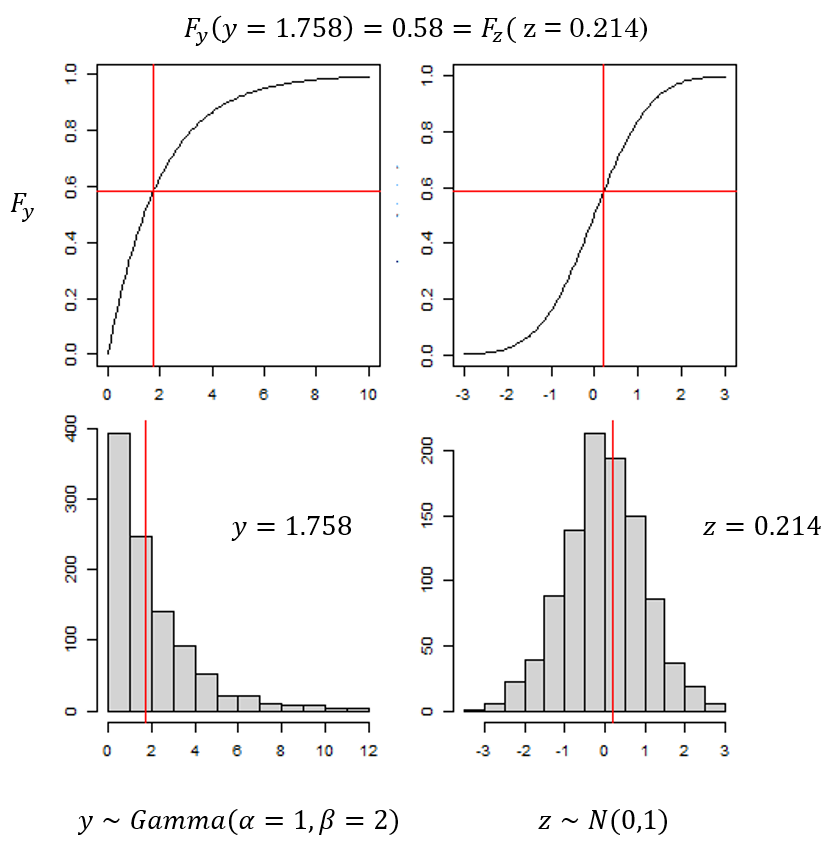

layout: true

.footnote[U.S. Department of Commerce | National Oceanic and Atmospheric Administration | National Marine Fisheries Service]


<style type="text/css">

code.cpp{
  font-size: 14px;
}
code.r{
  font-size: 14px;
}

.remark-slide-content > h1 {
  font-size: 40px;
}
.remark-slide-content > h3 {
  font-size: 25px;
  text-align: left !important;
  margin-left: 235px
}


</style>


```{r setup, include=FALSE}
options(htmltools.dir.version = FALSE)
```

```{r xaringan-tile-view, echo=FALSE}
# this gives you a tile navigation if you type "O" at any time
xaringanExtra::use_tile_view()
```

---
# Pearson residuals
<br><br>

.pull-left-narrow[
$$r_{i} = \frac{Y_{i} - E[Y_{i}]}{\sqrt{Var[Y_{i}]}}$$
]

.pull-right-wide[
**Latent Variable Model Issues**:

- Assumes the mean-variance relationship is equal to 1
- Correctly specified models invalidated more than expectecd
- Difficult to assess misspecified variance structure (ie. overdispersion, heteroscadacity)
]
---

# Quantile Residuals

.pull-left[
<br>
$r_i = \phi^{-1}\big(F(Y_i,\Theta)\big)$
<br><br>

- $F(Y,\Theta)$: cdf of $f(y,\Theta)$ 

- $\phi^{-1}$: cdf inverse of the standard normal distribution
<br><br>

]

.pull-right[
```{r, echo = FALSE, out.width="80%", fig.align="center"}

```

]
<br>
Dunn & Smyth, 1996
---
# Quantile Residuals and GLMMs
<br>

$$L(\theta) = \int_{\mathbb{R}}f(y;u,\theta)f(u;\theta)du$$


.large[
.p[ 
Considerations:
1. Closed form solution to cdf not always available
2. Need to account for correlation structure in residuals
]
]
---

# Approximations to the quantile resdiual
<br>
.p[ 
.pull-left[
**TMB residual methods**
- Analytical Calculations
- Laplace approximations to the cdf
- Bayesian simulations
- Methods: Full gaussian, one-step gaussian, one-step generic, cdf, MCMC via tmbstan
<br><br>
Kristensen et al., 2016 <br>
Thygesen, U. et al., 2017 <br>
Monnahan & Kristensen, 2018
]

.pull-right[
**DHARMa**
- Simulation-based approach
- Emiprical cdf
- Methods: Conditional, Unconditional
<br><br><br><br>
Hartig, F., 2022
]
]
---

# Two levels of residual calculation
<br>

**Unconditional residuals **

- Validate the data and random effect model simultaneously

**Conditional residuals**

- Validate the data model conditional on random effect MLEs
---
# TMB Methods
<br><br>

```{r, echo = FALSE}
mat <- rbind(
  c("FullGaussian", "Best approach when data and random effects are both normally distributed"),
  c("oneStepGaussian", "Most efficient one-step method when data and random effects are approximately normal" ),
  c("cdf", "One-step method that does not require normality but does require a closed form cdf"),
  c("oneStepGeneric", "One-step method useful when no closed form cdf but slow")
)
df <- as.data.frame(mat)
colnames(mat) <- c('Method', 'Definition')
knitr::kable(as.data.frame(mat))

```
* The cdf and oneStepGeneric methods are the only methods available for discrete data: randomized quantile residuals
* oneStepGeneric is dependent on Laplace approximations of likelihoods, so probably important to use TMB::checkConsistency.
* OSA residuals are challenging for some distributions (eg. multinomial, delta-lognormal, tweedie). 

---
# Full Gaussian Method<br>

Analytical calculation that assumes joint distribution of data and random effects is Gaussian. Applies rotation to transform to univariate space. 

.pull-left-wide[
**Correlated MNV**

```{r, echo = FALSE, out.width="75%", fig.align="center"}

```

]
.pull-right-narrow[
<br><br>
\begin{align}
y &\sim MVN(0, \Sigma)  \\
\end{align}
]
---
# Full Gaussian Method<br>

Analytical calculation that assumes joint distribution of data and random effects is Gaussian. Applies rotation to transform to univariate space. 

.pull-left-wide[
**Scale to unit variance**

```{r, echo = FALSE, out.width="75%", fig.align="center"}
knitr::include_graphics("static/demo_pairs2.png")
```
]
.pull-right-narrow[
<br><br>
\begin{align}
y &\sim MVN(0, \Sigma) \\
r &= y / sqrt(diag(\Sigma))
\end{align}
]
---
# Full Gaussian Method<br>

Analytical calculation that assumes joint distribution of data and random effects is Gaussian. Applies rotation to transform to univariate space. 
.pull-left-wide[
**Cholesky Transformation**

```{r, echo = FALSE, out.width="75%", fig.align="center"}

```
]
.pull-right-narrow[
<br><br>
\begin{align}
y &\sim MVN(0, \Sigma) \\
L &= cholesky(\Sigma)^{T} \\
r &= L^{-1}y
\end{align}
]
---
# TMB One-Step Methods
<br>
Steps through the data calculating quantile residuals for observation $i$ given all previous observations:


$r_{i} = \phi^{-1}(F(Y_{i}|Y_{1},\ldots, Y_{i-1},\Theta))$<br>

$\phi^{-1}$: inverse cdf of the standard normal<br>

$F(Y,\Theta)$: cdf of $f(Y,\Theta)$

* These residuals are independent standard normal when the model is appropriate for the data

* For non-random effects models these are equivalent to more familiar quantile residuals used with GLMs because
$F(Y_{i}|Y_{1},\ldots, Y_{i-1},\Theta) = F(Y_{i}|\Theta)$

```{r, echo = FALSE}
mat <- rbind(
  c("oneStepGaussian", "Most efficient one-step method when data and random effects are approximately normal" ),
  c("cdf", "One-step method that does not require normality but does require a closed form cdf"),
  c("oneStepGeneric", "One-step method useful when no closed form cdf but slow")
)
df <- as.data.frame(mat)
colnames(mat) <- c('Method', 'Definition')
knitr::kable(as.data.frame(mat))

```
---
# TMB One-Step Methods
<br>
C++ code needs to be modified:
```{Rcpp, eval = FALSE}
DATA_VECTOR(y);
DATA_VECTOR_INDICATOR(keep, y);
...
for(int i=0; i < N.size(); i++){
   nll -= keep[i] * dpois(y[i], exp(eta[i]), true);
   /* For cdf OSA residuals only: */
   Type cdf = squeeze( ppois(y[i], exp(eta[i])) );
   nll -= keep.cdf_lower[i] * log( cdf );       // NaN protected
   nll -= keep.cdf_upper[i] * log( 1.0 - cdf ); // NaN protected
}

```
---
# TMB MCMC Method<br>
Bayesian simulation approach
.pull-left[
**Simplified algorithm**
.p[
1. Map fixed parameters to their MLEs
2. Create a new object
3. Draw a single posterior from an MCMC chain
4. Use the posterior random vector to recalculate the expected value and plug into cdf calculations
5. Relies on conditional independence rather than rotation
]
]

.pull-right[
<br>
```{r, eval = FALSE}
obj2 <- MakeADFun(data, MLEs, map)

fit <- tmbstan(obj2, iter = warmup+1)

sample <- extract(fit)$u

mu <- beta0 + u

r <- qnorm(y, mu, sd)
```
]
---

# DHARMa method

.pull-left[
<br><br>
```{r, echo = FALSE}
mat <- rbind(
  c("Conditional ecdf", "Simulate new observations conditional on the fitted random effects
"),
  c("Unconditional ecdf", "Simulate new observations given new simulated random effects
" )
)
df <- as.data.frame(mat)
colnames(mat) <- c('Method', 'Definition')
knitr::kable(as.data.frame(mat))

```
]
.pull-right[
```{r, echo = FALSE, out.width="100%", fig.align="center"}
knitr::include_graphics("static/dharma-ecdf.png")
```
.small[source: Florian Hartig, DHARMa package]
]

---
#Simulation Study<br>

<br><br>
.p[ 
For each iteration(i=500):
1. Data (n=100) were simulated.
2. Data were fit to the correctly specified (h0) and mis-specified (h1) models
3. TMB and DHARMa residuals were calculated for h0 and h1.
4. Step 3 was repeated using true parameter values to calculate theoretical residuals.
5. GOF p-values were calculated using the Kolmogorov-Smirnov test.
]

Distribution of GOF p-values:
- Uniform under simulation of the correctly specified model
- Skewed towards 1 under simulation of mis-specified model
---
# Linear Regression example<br>
When models do not contain random effects, quantile residual approximations from a normal model should collapse to Pearson
.pull-left[
\begin{align}
\mu &= X\beta\\
y &\sim N(\mu, \sigma)
\end{align}
]
.pull-right[
```{r, echo = FALSE, out.width="100%", fig.align="center"}


```
]
---
# Linear Regression example<br>
When models do not contain random effects, quantile residual approximations from a normal model should collapse to Pearson

.pull-left[
**Mis-specified model**:<br>
\begin{align}
OM:&\\
y &= X\beta + \epsilon\\
\epsilon &\sim LN(0,1)\\
EM:&\\
y &= X\beta + \epsilon\\
\epsilon &\sim N(0,1)
\end{align}
]
.pull-right[
```{r, echo = FALSE, out.width="100%", fig.align="center"}


```
]

---
#Random walk example
<br>
.p[
.pull-left-extra-narrow[
**Model**:  
\begin{align}
\mu_{i} &= u_{i-1} + a \\
u_{i} &\sim N(\mu_{i},\tau) \\
y_{i} &\sim N(u_{i}, \sigma) 
\end{align}
]

.pull-right-extra-wide[
.pull-left-narrow[
**Parameters**:
\begin{align}
a &= 0.75 \\
\tau &= 1 \\ 
\sigma &= 1 
\end{align}
]
.pull-right-wide[
**Mispecification**: 

1. Data simulated with drift term, a
2. Data fit to model without drift term
]
]
]

---
# Unconditional Level
.large[**Validate the data and random effect model simultaneously**]
<br>

.pull-left-narrow[
**TMB**
- **Full Gaussian**
]
.pull-right-wide[
<br><br>
Analytical calculation of the quantile residual of a hierarchical model

$y,u \sim MVN(\mu, \Sigma)$
```{r, eval = FALSE}
L <- t(chol(Sigma))
mode <- y - mu
r <- solve(L, mode)

#TMB model
obj <- MakeADFun(data, parameters, 
                 random = "u")
opt <- nlminb(obj$par, obj$fn, obj$gr)

#TMB residual calculation
oneStepPredict(obj, observation.name = "y",
               method = "fullGaussian")
```
]
---
# Unconditional Level
.large[**Validate the data and random effect model simultaneously**]
<br>

.pull-left-narrow[
**TMB**
- Full Gaussian method
- **MCMC**
]
.pull-right-wide[
<br><br>
Draw random effects from a posterior MCMC chain
```{r, eval = FALSE}
#TMB model
obj <- MakeADFun(data, parameters, 
                 random = "u")
opt <- nlminb(obj$par, obj$fn, obj$gr)

#Fix MLES and draw one posterior
obj2 <- MakeADFun(..., map = map)
sample <- extract( tmbstan(obj2, iter = warmup+1) )$u

#residuals using posterior u
Fy <- pnorm(y, u, sigma)
r <- qnorm(Fy)
```
]

---
# Unconditional Level
.large[**Validate the data and random effect model simultaneously**]
<br>

.pull-left-narrow[
TMB
- Full Gaussian method
- MCMC

**DHARMa**
- **Unconditional**
]
.pull-right-wide[
<br><br>
Empircal cdf approximation using simulated random effects and rotated data (optional)
```{r, eval = FALSE}
#Simulate new random effects and data use MLEs
u.sim <- rnorm(mu, tau)
y.sim <- rnorm(u.sim, sigma)

#cholesky decomposition based on estimated Sigma
L <- t(chol(Sigma))

#rotate simulated data and observations
y.sim <- apply(y.sim, 2, function(x) solve(L,x))
y <- solve(L, y)

#empirical cdf on rotated data and simulation
r <- ecdf(y.sim)(y)

```

]

---
# Unconditional Level
.large[**Validate the data and random effect model simultaneously**]
<br>

.pull-left-narrow[
TMB
- Full Gaussian method
- MCMC

**DHARMa**
- **Unconditional**
]
.pull-right-wide[
<br><br>
Empircal cdf approximation using simulated random effects and rotated data (optional)
```{r, eval = FALSE}
#TMB model
obj <- MakeADFun(data, parameters, 
                 random = "u")
opt <- nlminb(obj$par, obj$fn, obj$gr)

obj$env$data$simRE <- 1
y.sim <- obj$simulate()$y

#DHARMa residual function:
createDHARMa(y.sim, y, rotation = "estimated")
```

]

---
# Results: Unconditional Level
```{r, include = FALSE, warning = FALSE, message = FALSE }
 library(dplyr)
 library(magrittr)
 library(viridis)
 library(ggplot2)
 library(tidyr)
 library(kableExtra)
 library(ggh4x)

 path <- "C:/users/Andrea.Havron/Documents/github-noaa/colemonnahan/mixed_resids/results"
 pvals <- lapply(list.files(path, pattern='_pvals.RDS',
                           full.names=TRUE), readRDS) %>% bind_rows
 
 pvals$version <- factor(pvals$version,
                         levels = c('h0', 'h1'),
                         labels = c('correct',
                                    'mis-specified'))

 #Theoretical
 pval.df <- dplyr::filter(pvals, model == "randomwalk" & test == "GOF.ks" & 
                   (method == "uncond" | method == "uncond_nrot" | 
                       method == "fg" | method == "mcmc" ) & 
                       do.true == TRUE & version == "correct")
 run_tally <- group_by(pval.df, method) %>% summarize(count=length(unique(replicate)))
 pval.df$method <- factor(pval.df$method, 
                       levels = c('fg',  'mcmc', 
                                  'uncond', 
                                  'uncond_nrot'),
                       labels = c('full Gaussian',
                                  'MCMC',
                                  'DHARMa rotated',
                                  'DHARMa not rotated'))
 
 pval.method.true <- pivot_wider(pval.df,  id_cols = !type, names_from = "method", 
                                 values_from = pvalue) %>% 
   select(., levels(pval.df$method)) %>%
   apply(., 2, function(x) sum(x < 0.05))/run_tally$count

 p.true <-  ggplot(pval.df, aes(pvalue, fill = version, color=version)) +
   facet_grid2(version~method, scales = "free_y", independent = "y",
              labeller = label_wrap_gen(12)) + 
   geom_histogram(position ='identity', bins = 50) +
   scale_fill_viridis_d() + 
   scale_color_viridis_d()  +  theme_bw() +
   theme(axis.text.x = element_text(size = 8),
         strip.text.x = element_text(size = 12),
         strip.text.y = element_text(size = 15),
         legend.position="none")

 
 #Estimated
 pval.df <- filter(pvals, model == "randomwalk" & test == "GOF.ks" & 
                   (method == "uncond" | method == "uncond_nrot" | 
                       method == "fg" | method == "mcmc" ) & do.true == FALSE)
 
 run_tally <- group_by(pval.df, method, version) %>% summarize(count=length(unique(replicate)))
 
 pval.df$method <- factor(pval.df$method, 
                       levels = c('fg',  'mcmc', 
                                  'uncond', 
                                  'uncond_nrot'),
                       labels = c('full Gaussian',
                                  'MCMC',
                                  'DHARMa rotated',
                                  'DHARMa not rotated'))
 
 pval.method.est.h0 <- filter(pval.df, version == "correct") %>%
   pivot_wider(.,  id_cols = !type, names_from = "method", 
               values_from = pvalue) %>%     
   select(., levels(pval.df$method)) %>%
   apply(., 2, function(x) sum(x < 0.05))/filter(run_tally, version == "correct")$count
 pval.method.est.h1 <- filter(pval.df, version == "mis-specified") %>%
   pivot_wider(.,  id_cols = !type, names_from = "method", 
               values_from = pvalue) %>%     
   select(., levels(pval.df$method)) %>%
   apply(., 2, function(x) sum(x < 0.05, na.rm = TRUE))/filter(run_tally, version == "mis-specified")$count
 
 p.est <-  ggplot(pval.df, aes(pvalue, fill = version, color=version)) +
   facet_grid2(version~method, labeller = label_wrap_gen(12), 
               scales = "free_y", independent = "y") + 
   geom_histogram(position ='identity', bins = 50,
                  show.legend = FALSE) +
   scale_fill_manual(values = c("#440154FF", "#35B779FF")) + 
   scale_color_manual(values = c("#440154FF", "#35B779FF")) +  theme_bw() +
   theme(axis.text.x = element_text(size = 8),
         strip.text.x = element_text(size = 12),
         strip.text.y = element_text(size = 15))
```

.pull-left[
Theoretical residual p-values
```{r, echo = FALSE, fig.height = 2.6}
knitr::opts_chunk$set(dev.args = list(png = list(type = "cairo")))
p.true
```
Type I error:
```{r, echo = FALSE}
vec <- pval.method.true
new.vec <- c(" ", " ")
for(i in 1:length(vec)){
  new.vec <- c(new.vec, vec[i], " ", " ")
}
kbl(as.data.frame(t(new.vec)), col.names = NULL)
```
.small[
**Significance level**: <br>0.05 <br><br>
**Type I error**: <br>
Probability of falsely rejecting the correctly specified model <br><br>
**Power**: <br>
Probabilty of correctly rejecting the mis-specified model 
]
]

.pull-right[
Estimated residual p-values
```{r, echo = FALSE, fig.height = 4.5}
knitr::opts_chunk$set(dev.args = list(png = list(type = "cairo")))
p.est

```

```{r, echo = FALSE}
df <- t(data.frame(c("Type I", "Error" , rep("",2)),
                 pval.method.est.h0,
                 c("Power" , rep("",3)),
                 pval.method.est.h1))
                   
row.names(df) <- NULL
kable(df, col.names = NULL, align = rep("r",5)) %>%
  row_spec(., 1:4, background = "#FFFFFF") %>%
  row_spec(., 2, extra_css = "border-bottom: 1px solid") %>%
  row_spec(., 3, align = "l")
```

]

---

# Conditional Level
.large[**Validate the data model conditional on random effect MLEs**]
<br>

.pull-left-narrow[
**TMB**
- **One-step ahead**

  - gaussian
  - cdf
  - generic
]
.pull-right-wide[
```{r, eval = FALSE}
#TMB model
obj <- MakeADFun(data, parameters, 
                 random = "u")
opt <- nlminb(obj$par, obj$fn, obj$gr)

#TMB residual calculation for continuous data
oneStepPredict(obj, observation.name = "y",
               data.term.indicator = "keep"
               method = "oneStepGaussian")

#TMB residual calculation for discrete data
oneStepPredict(obj, observation.name = "y",
               data.term.indicator = "keep"
               method = "cdf", discrete = TRUE)
```
]
---
# Conditional Level
.large[**Validate the data model conditional on random effect MLEs**]
<br>

.pull-left-narrow[
TMB
- One-step ahead

  - gaussian
  - cdf
  - generic
  
**DHARMa**
- **Conditional**

]
.pull-right-wide[
<br><br>
Empircal cdf approximation using estimated random effects
```{r, eval = FALSE}
#Simulate data using MLEs
y.sim <- rnorm(u, sigma)

#TMB model
obj <- MakeADFun(data, parameters, 
                 random = "u")
opt <- nlminb(obj$par, obj$fn, obj$gr)

obj$env$data$simRE <- 0
y.sim <- obj$simulate()$y

#empirical cdf on conditionally iid data
r <- ecdf(y.sim)(y)
```
]

---
# Results: Conditional Level
```{r, include = FALSE, warning = FALSE, message = FALSE }

 #Theoretical
 pval.df <- filter(pvals, model == "randomwalk" & test == "GOF.ks" & 
                   (method == "osg" | method == "cond_nrot" | 
                      #method == "cond" | 
                      method == "cdf" | method == "gen" ) &
                     do.true == TRUE & version == "correct")
 run_tally <- group_by(pval.df, method) %>% summarize(count=length(unique(replicate)))
 pval.df$method <- factor(pval.df$method, 
                          levels = c('osg',  'cdf',  'gen', 
                                     #'cond', 
                                     'cond_nrot'),
                          labels = c('one-step Gaussian',
                                     'cdf',
                                     'one-step Generic',
                                     #'DHARMa rotated',
                                     'DHARMa conditional'))
 
 pval.method.true <- pivot_wider(pval.df,  id_cols = !type, names_from = "method", 
                                 values_from = pvalue) %>% 
   select(., levels(pval.df$method)) %>%
   apply(., 2, function(x) sum(x < 0.05))/run_tally$count
 
 p.true <-  ggplot(pval.df, aes(pvalue, fill = version, color=version)) +
   facet_grid(version~method, labeller = label_wrap_gen(12)) + 
   geom_histogram(position ='identity', bins = 50) +
   scale_fill_viridis_d() + 
   scale_color_viridis_d()   +  theme_bw() +
   theme(axis.text.x = element_text(size = 8),
         strip.text.x = element_text(size = 12),
         strip.text.y = element_text(size = 15),
         legend.position="none")
 
 #Estimated
 pval.df <- filter(pvals, model == "randomwalk" & test == "GOF.ks" & 
                   (method == "osg" | method == "cond_nrot" | #method == "cond" | 
                       method == "cdf" | method == "gen" ) & do.true == FALSE)
 
 pval.df$method <- factor(pval.df$method, 
                          levels = c('osg',  'cdf',  'gen', 
                                     #'cond', 
                                     'cond_nrot'),
                          labels = c('one-step Gaussian',
                                     'cdf',
                                     'one-step Generic',
                                     #'DHARMa rotated',
                                     'DHARMa conditional'))
 
 pval.method.est.h0 <- filter(pval.df, version == "correct") %>%
   pivot_wider(.,  id_cols = !type, names_from = "method", 
               values_from = pvalue) %>%     
   select(., levels(pval.df$method)) %>%
   apply(., 2, function(x) sum(x < 0.05))/500
 pval.method.est.h1 <- filter(pval.df, version == "mis-specified") %>%
   pivot_wider(.,  id_cols = !type, names_from = "method", 
               values_from = pvalue) %>%     
   select(., levels(pval.df$method)) %>%
   apply(., 2, function(x) sum(x < 0.05, na.rm = TRUE))/500
 
 p.est <-  ggplot(pval.df, aes(pvalue, fill = version, color = version)) +
   facet_grid(version~method, labeller = label_wrap_gen(10), scales = "free_y") + 
   geom_histogram(position ='identity', bins = 50,
                  show.legend = FALSE) +
   scale_fill_manual(values = c("#440154FF", "#35B779FF")) + 
   scale_color_manual(values = c("#440154FF", "#35B779FF")) +  theme_bw() +
   theme(axis.text.x = element_text(size = 8),
         strip.text.x = element_text(size = 11),
         strip.text.y = element_text(size = 15))
```

.pull-left[
Theoretical residuals
```{r, echo = FALSE, fig.height = 2.6}
knitr::opts_chunk$set(dev.args = list(png = list(type = "cairo")))
p.true
```
Type I error:
```{r, echo = FALSE}
vec <- pval.method.true
new.vec <- c(" ")
for(i in 1:length(vec)){
  new.vec <- c(new.vec, vec[i], " ")
}
kbl(as.data.frame(t(new.vec)), col.names = NULL)
```
.small[
**Significance level**: <br>0.05 <br><br>
**Type I error**: <br>
Probability of falsely rejecting the correctly specified model <br><br>
**Power**: <br>
Probabilty of correctly rejecting the mis-specified model 
]
]

.pull-right[
Estimated Residuals
```{r, echo = FALSE, fig.height = 4.5}
knitr::opts_chunk$set(dev.args = list(png = list(type = "cairo")))
p.est
```

```{r, echo = FALSE}
df <- t(data.frame(c("Type I", "Error" , rep("",2)),
                 pval.method.est.h0,
                 c("Power" , rep("",3)),
                 pval.method.est.h1))
                   
row.names(df) <- NULL
kable(df, col.names = NULL, align = rep("r",4)) %>%
  row_spec(., 1:4, background = "#FFFFFF") %>%
  row_spec(., 2, extra_css = "border-bottom: 1px solid") %>%
  row_spec(., 3, align = "l")
```
]

---

# Guidelines in Progress
<br>

- Models with correlated random effect structure need to account for correlation in residuals

  - TMB's Full Gaussian method is preferred if data and RE are normal
  - DHARMa rotation needs to be implemented 
  - TMB's one-step methods account for correlation through conditioning 
  - DHARMa's conditional methods account for correlation through conditioning 
  - MCMC approach accounts for correlation but may lack power to detect mis-specification

- TMB limitations:

  - One-step methods cannot be used when data are a mixture of continuous and discrete data
  
- DHARMa limitations:

  - Estimating the data covariance matrix may be more prone to error when data are not normal


