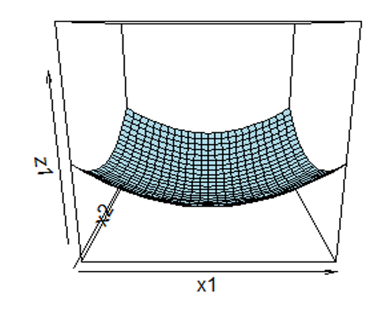

layout: true

.footnote[U.S. Department of Commerce | National Oceanic and Atmospheric Administration | National Marine Fisheries Service]


<style type="text/css">

code.cpp{
  font-size: 14px;
}
code.r{
  font-size: 14px;
}


</style>


```{r setup, include=FALSE}
options(htmltools.dir.version = FALSE)
```

```{r xaringan-tile-view, echo=FALSE}
# this gives you a tile navigation if you type "O" at any time
xaringanExtra::use_tile_view()
```

---
#TMB Advanced Topics<br><br><br>

#### 1. Dealing with Parameters
#### 2. Uncertainty
#### 3. Simulation
#### 4. Correlated Gaussian random effects
#### 5. Diagnostics
---
#Maturity at age model<br>
The number of mature fish, $Y_{y,a}$ out of the total number of fish, $N_{y,a}$ at year, $y$ and age, $a$, can be expressed as a binomial distribution,

$$Y_{y,a} \sim Binom(N_{y,a}, p_{y,a})$$,

where $p$ represents the probability of maturity. Common to estimate maturity using logistic regression: 

$$log\left(\frac{p_{y,a}}{1-p_{y,a}}\right) = \eta_{y,a} = \beta_0 + \beta_1 a$$

The age of 50% maturity is $a_{50} = -\frac{\beta_0}{\beta_1}$,

---
#Maturity at age model<br>

.pull-left[
```cpp
#include <TMB.hpp>

template<class Type>
Type objective_function<Type>::operator()()
{
  DATA_VECTOR(Y);
  DATA_VECTOR(N);
  DATA_VECTOR(age_obs); 
  DATA_INTEGER(max_age); 
  PARAMETER_VECTOR(beta); 

  int n_obs = Y.size();
  vector<Type> nll(n_obs);
  nll.setZero();
     
  vector<Type> logit_mat(n_obs);
  vector<Type> mat(n_obs);
  for(int i = 0; i < n_obs; i++) {
    logit_mat(i) = beta(0) + 
       beta(1)*age_obs(i); 
    mat(i) = 1/(1 + exp(-logit_mat(i)));
    nll(i) = -dbinom(Y(i), N(i), mat(i),1); 
  }

  return sum(nll);
}
```
]

.pull-right[
Simulate data
```{r, eval = FALSE}
a50 = 5
slope = 2
beta = c(-slope*a50,slope)
ages = t(matrix(1:20, 20, 40))
mat = 1/(1+exp(-(beta[1] + beta[2]*ages)))
set.seed(123)
samp <- sample(50:100, length(ages),
               replace=TRUE)
N = matrix(samp, nrow = 20)
ysim <- rbinom(length(N), N, mat)
Y = matrix(ysim, nrow = 20)
```
]
---

#Maturity at age model<br>

.pull-left[
```cpp
#include <TMB.hpp>

template<class Type>
Type objective_function<Type>::operator()()
{
  DATA_VECTOR(Y);
  DATA_VECTOR(N);
  DATA_VECTOR(age_obs); 
  DATA_INTEGER(max_age); 
  PARAMETER_VECTOR(beta); 

  int n_obs = Y.size();
  vector<Type> nll(n_obs);
  nll.setZero();
     
  vector<Type> logit_mat(n_obs);
  vector<Type> mat(n_obs);
  for(int i = 0; i < n_obs; i++) {
    logit_mat(i) = beta(0) + 
       beta(1)*age_obs(i); 
    mat(i) = 1/(1 + exp(-logit_mat(i)));
    nll(i) = -dbinom(Y(i), N(i), mat(i),1); 
  }

  return sum(nll);
}
```
]

.pull-right[
Run model
```{r, eval = FALSE}
library(TMB)
compile("maturity_0.cpp")
dyn.load(dynlib("maturity_0"))

input = list(data=list(),par=list())
input$par$beta = c(0,0)
input$data$Y = c(Y)
input$data$N = c(N)
input$data$age_obs = c(ages)
input$data$max_age = max(ages)

mod = MakeADFun(input$data, input$par, 
                DLL = "maturity_0")

opt = nlminb(mod$par, mod$fn, mod$gr)
```
]

---

#Overdispersed model<br>
.pull-left[
```cpp
#include <TMB.hpp>
template<class Type>
Type dbetabinom(Type x, Type n, Type p, Type phi, int do_log)
{
  Type ll = lgamma(n + 1.0) - lgamma(x + 1.0) - lgamma(n - x + 1.0) + 
    lgamma(x + p*phi) + lgamma(n - x +(1-p)*phi) - lgamma(n + phi) +
    lgamma(phi) - lgamma(p*phi) - lgamma((1-p)*phi);
  if(do_log) return(ll);
  else {
    return(exp(ll));  
  }
}
```
]

.pull-right[]
```cpp
template<class Type>
Type objective_function<Type>::operator()()
{
  DATA_VECTOR(Y); //number mature
  DATA_VECTOR(N); //number of mature + not mature
  DATA_VECTOR(age_obs); //age for each observation
  DATA_INTEGER(max_age); //to generate a maturity ogive
  PARAMETER_VECTOR(beta); //intercept, slope
  PARAMETER(log_phi);
  Type phi = exp(log_phi);

  int n_obs = Y.size();
  vector<Type> nll(n_obs);
  nll.setZero();
     
  vector<Type> logit_mat(n_obs), mat(n_obs);
  for(int i = 0; i < n_obs; i++) {
    logit_mat(i) = beta(0)  + beta(1)*age_obs(i); 
    mat(i) = 1/(1 + exp(-logit_mat(i)));
    nll(i) = -dbetabinom(Y(i), N(i), mat(i), phi, 1); //negative log-likelihood
  }

  return sum(nll);
}
```
]

---
class: middle

#Dealing with parameters
---
#Parameter transformations

#### Two types of transformations:
1. Individual parameters to map from real to parameter space
  * Minimizers search for MLE from $-\infty$ to $+\infty$
  * Certain parameters have restricted support:
      * $\sigma^{2} > 0$
        ```cpp
        sigma = exp(ln_sigma)
        ```
      * $0 < \pi < 1$ 
      ```cpp
      pi = 1/(1 + exp(-logit_pi)) # "expit"
      ```
2. Expected values of distributions
  * Generalized Linear or Generalized Linear Mixed Models: model a function of the mean that is linear in X, for example:
    * $\eta = X\beta$
    * $y \sim \text{Pois}(exp(\eta))$
    * $y \sim \text{Binomial}(N, expit(\eta))$
  
---
#Parameter mapping
#### TMB allows users to collect and fix parameters using the map argument in MakeADFun()
* The parameter map is a list of parameters that are fixed or collected in a model run
* Parameter names and dimensions in the map list must match those of the parameter list
* The map list is structured as a list of factors
* Parameters with factor(NA) are fixed
* Parameters with equal factor levels are collected to a common value

```{r, eval = FALSE}
#fix slope = 0 : constant proportion with age
input$map$beta = factor(c(1,NA)) 

#intercept = slope
input$map$beta = factor(c(1,1)) 
```

---
#Derived parameters
#### REPORT() and ADREPORT
* output supplied to REPORT() will be available on R side using mod$report()
* output supplied to ADREPORT() will have uncertainty estimated using TMB::sdreport()

.pull-left[
```cpp
  vector<Type> logit_mat_at_age(max_age);
  for(int i = 0; i < max_age; i++) logit_mat_at_age(i) = beta(0)  + beta(1)*Type(i+1);
  vector<Type> mat_at_age = 1/(1+ exp(-logit_mat_at_age));
  Type a50 = -beta(0)/beta(1);
  REPORT(mat);
  ADREPORT(a50);
  REPORT(nll);
  ADREPORT(logit_mat_at_age);
  ADREPORT(mat_at_age);
  return sum(nll);
  ...
  
```
]
.pull-right[
```{r, eval = FALSE}
opt = nlminb(mod$par, mod$fn, mod$gr)
mod$rep = mod$report()
mod$sdrep = sdreport(mod)
summary(mod$sdrep)

```
]

---
class: middle

#Uncertainty


---
#Estimating Uncertainty<br><br>

Uncertainty estimates can be calculated in several ways with TMB
 * Asymptotic approximation + delta method (TMB::sdreport)
 * Likelihood profiles (TMB::tmbprofile)

---
#TMB::sdreport
#### as.list.sdreport()

```{r, eval = FALSE}
logit_mat = as.list(mod$sdrep, "Estimate", report = TRUE)$logit_mat_at_age
logit_mat.se =as.list(mod$sdrep, "Std. Error", report = TRUE)$logit_mat_at_age
logit_mat.ci =matrix(logit_mat, 20, 2) + cbind(-qnorm(0.975)*logit_mat.se, qnorm(0.975)*logit_mat.se)
plot(ages[1,], 1/(1+exp(-logit_mat)), type = 'l', ylim = c(0,1))
polygon(c(ages[1,],rev(ages[1,])), 1/(1 + exp(-c(logit_mat.ci[,1],rev(logit_mat.ci[,2])))), lty = 2)
```
```{r, echo = FALSE, out.width="60%", fig.align="center"}

```


---
# Lkelihood Profiles<br><br>
* Does not make the asymptotic normal assumption

* Essentially: Refit model at series of points, doing likelihood ratio tests at each one

* Theory not covered here, but a good approach.

* Easy to do in TMB: 
```{r, eval = FALSE}
#profile beta0
prof <- TMB::tmbprofile(mod, 1)
plot(prof)
confint(prof)
```

* Then plot(prof) and confint(prof) plot and give 95% range

* This interval may not be symmetic nor finite

---
class: middle

# Simulation
---
# Simulation in TMB

* Standard generator functions to simulate data within the TMB model:

```cpp
rnorm()           rpois()           runif()
rbinom()          rgamma()          rexp()          
rbeta()           rf()              rlogis()  
rt()              rweibull()        rcompois()
rtweedie()        rnbinom()         rnbinom2()
```


* Simulation blocks are used to call simulations from R

.pull-left[
```cpp
for(int i = 0; i < n_obs; i++){
  logit_mat(i) = beta(0) + 
     beta(1)*age_obs(i); 
  mat(i) = 1/(1 + exp(-logit_mat(i)));
  nll(i) = -dbinom(Y(i), N(i), mat(i),1); 
  SIMULATE{
    Y(i) = rbinom(N(i), mat(i));
  }
}
SIMULATE{
  REPORT(Y);
}
```
]

.pull-right[
```{r, eval = FALSE}
mod <- MakeADFun(input$data, input$par, 
                DLL = "maturity_0")

opt <- nlminb(mod$par, mod$fn, mod$gr)

y.sim <- mod$simulate()
```
]

---
class: middle

# Correlated random effects

---
# AR(1) random effects
.pull-left[
```cpp
template<class Type>
Type objective_function<Type>::operator() ()
{
  DATA_VECTOR(Y); //number mature
  DATA_VECTOR(N); //number of mature + not mature
  DATA_VECTOR(age_obs); //age for each observation
  DATA_IVECTOR(re_ind); //indicator for random effect for each observation
  DATA_INTEGER(max_age); //to generate a maturity ogive
  PARAMETER_VECTOR(beta); //intercept, slope
  PARAMETER(log_phi);
  PARAMETER_VECTOR(AR_pars); //AR1 process (2 pars)
  PARAMETER_VECTOR(re); //annual ar1 process
  Type phi = exp(log_phi);

  int n_obs = Y.size();
  vector<Type> nll_re(re.size());
  vector<Type> nll(n_obs);
  nll.setZero();
  nll_re.setZero();

  Type sig_re = exp(AR_pars(0));
  Type rho_re = -1 + 2/(1+exp(-AR_pars(1)));
  nll_re(0) -= dnorm(re(0), Type(0), sig_re*exp(-Type(0.5) * log(1 - pow(rho_re,Type(2)))), 1);
  for(int y = 1; y < re.size(); y++) nll_re(y) -= dnorm(re(y), rho_re * re(y-1), sig_re, 1);
  SIMULATE{
    re(0) = rnorm(Type(0), sig_re*exp(-Type(0.5) * log(Type(1) - pow(rho_re,Type(2)))));
    for(int y = 1; y < re.size(); y++) re(y) = rnorm(rho_re * re(y-1), sig_re);
    REPORT(re);
  }
  
```
]
.pull-right[
```cpp
  vector<Type> logit_mat(n_obs), mat(n_obs);
  for(int i = 0; i < n_obs; i++) {
    logit_mat(i) = beta(0)  + beta(1)*age_obs(i) + re(re_ind(i)); 
    mat(i) = 1/(1 + exp(-logit_mat(i)));
    nll(i) = -dbetabinom(Y(i), N(i), mat(i), phi, 1); //negative log-likelihood
  }
  SIMULATE {
    for(int i = 0; i < n_obs; i++) Y(i) = rbetabinom(N(i), mat(i), phi);
    REPORT(Y);
  }
  
  return sum(nll) + sum(nll_re);
}  
```
]

---
# AR(1) random effects
.pull-left[
 ```{r, eval = FALSE}
compile("maturity_bb_re.cpp")
dyn.load(dynlib("maturity_bb_re"))

a50 = 5
slope = 0.5
beta = c(-slope*a50,slope)
phi = 1000 #as -> Inf betabin -> binomial
#phi = 0.1 #as -> Inf betabin -> binomial
ages = t(matrix(1:20, 20, 40))
years = matrix(1:40, 40,20)
mat = 1/(1+exp(-(beta[1] + beta[2]*ages)))
set.seed(123)
N = matrix(sample(50:100, length(ages),replace=TRUE), 40,20)
mat_bb = rbeta(length(N),mat*phi, (1-mat)*phi)
Y_bb = matrix(rbinom(length(N), N, mat_bb), nrow = 40,20)

gen.logit <- function(x, low, upp) return(log((x-low)/(upp-x)))

input = list(data=list(),par=list())
input$par$beta = beta
input$par$log_phi = log(phi)
input$par$AR_pars = c(log(1), gen.logit(0.5,-1,1))
input$par$re = rep(0, NROW(Y_bb))

input$data$Y = c(Y_bb)
input$data$N = c(N)
input$data$re_ind = c(years)-1
input$data$age_obs = c(ages)
input$data$max_age = max(ages)
```
]
.pull-right[
```{r eval = FALSE}
mod = MakeADFun(input$data, input$par, random = "re", DLL = "maturity_bb_re")
input$data = mod$simulate(complete=TRUE)
mod = MakeADFun(input$data, input$par, random = "re", DLL = "maturity_bb_re")
opt = nlminb(mod$par, mod$fn, mod$gr)
```
]

---
# AR(1) random effects
* TMB has multivariate normal distributions available in density namespace
```{r, echo = FALSE}
mat <- rbind(
  c("AR1", "First-order Autoregressive"),
  c("ARk", "k-order Autoregressive" ),
  c("MVNORM", "multivariate normal with user-specified covariance matrix" ),
  c("SEPARABLE", "separable densities on array: each dimension has marginal defined by components")
)
df <- as.data.frame(mat)
colnames(mat) <- c('Type', 'Definition')
knitr::kable(as.data.frame(mat))

```

---
class: middle

#Model Validation

---

#Validating the Laplace Approximation
* For mixed effects models, TMB allows one to test whether the the Laplace approximation of the marginal log-likelihood and joint log-likelihood is ok. 
$$E \nabla_{\theta} P(X|\theta)= 0$$
$$E \nabla_{\theta,u} P(X,U|\theta)= 0$$
* Simulate data and calculate gradients for each simulated data set
* Average gradient should be 0 when the Laplace approximation is ok
```{r, eval = FALSE}
check <- TMB::checkConsistency(mod)
summary(check)
```
* performs $\chi^2$ test for gradient bias for marginal and joint
* provides estimates of bias for fixed effects parameters
* increasing sample sizes will increase power of $\chi^2$ test for (small) bias 
---

# Quantile Residuals<br>


* TMB's **oneStepPredict()** function steps through the data calculating quantile residuals for observation $i$ given all previous observations:

.pull-left[<br>
$r_{i} = \phi^{-1}(F(Y_{i}|Y_{1},\ldots, Y_{i-1},\Theta))$<br>

$\phi^{-1}$: inverse cdf of the standard normal<br>

$F(Y,\Theta)$: cdf of $f(Y,\Theta)$

* These residuals are independent standard normal when the model is appropriate for the data

* For non-random effects models these are equivalent to more familiar quantile residuals used with GLMS because
$F(Y_{i}|Y_{1},\ldots, Y_{i-1},\Theta) = F(Y_{i}|\Theta)$

]

.pull-right[

]
---
# TMB OSA methods<br><br>

```{r, echo = FALSE}
mat <- rbind(
  c("FullGaussian", "Best approach when data and random effects are both normally distributed"),
  c("oneStepGaussian", "Most efficient one-step method when data and random effects are approximately normal" ),
  c("cdf", "One-step method that does not require normality but does require a closed form cdf"),
  c("oneStepGeneric", "One-step method useful when no closed form cdf but slow")
)
df <- as.data.frame(mat)
colnames(mat) <- c('Method', 'Definition')
knitr::kable(as.data.frame(mat))

```
* The cdf and oneStepGeneric methods are the only methods available for discrete data: randomized quantile residuals
* OSA residuals are challenging for some distributions (eg. delta-lognormal, tweedie)

---
# Implementing OSA in TMB<br>

.pull-left[
```cpp
DATA_VECTOR(Y);
DATA_VECTOR(N);
DATA_VECTOR(age_obs); 
DATA_INTEGER(max_age); 
PARAMETER_VECTOR(beta); 

DATA_VECTOR_INDICATOR(keep, Y);

...

for(int i = 0; i < n_obs; i++) {
  logit_mat(i) = beta(0) + 
     beta(1)*age_obs(i); 
  mat(i) = 1/(1 + exp(-logit_mat(i)));
  nll(i) -= keep(i) * 
      (dbinom(Y(i), N(i), mat(i),1)); 
  //extra lines required for cdf method:
  //example given using ppois 
  //pbinom not in TMB
  Type cdf = squeeze(ppois(mean(i)));
  nll -= keep.cdf_lower[i] * 
      log( cdf );      
  nll -= keep.cdf_upper[i] * 
      log( 1.0 - cdf ); 
}

```
]

.pull-right[
```{r, eval = FALSE}
mod <- MakeADFun(input$data, input$par, 
                DLL = "maturity_0")

opt <- nlminb(mod$par, mod$fn, mod$gr)

osa <- oneStepPredict(
  mod, 
  observation.name = "Y",
  data.term.indicator = "keep",
  method = "oneStepGeneric", 
  discrete = TRUE
)
```
]


---
##Asymptotic approximation with $f''$

The second derivative measures the curvature of the likelihood and is approximately equal to the negative inverse of the variance when evaluated at the MLE

Poisson Likelihood: $f(y) = \frac{e^{-\lambda}\lambda^{y}}{y!}$, for **y = 2**:
.three-column[
log-likelihood: 


$\small \ell(\lambda) = -\lambda + ylog(\lambda) - log(y!)$
```{r echo = FALSE}
curve(log(dpois(2,x)), xlab = expression(lambda), ylab = expression("l("~ lambda ~ "|y=2)"),0,5, cex.lab = 1.5)
```

]

.three-column[
1st derivative: 

$\frac{d\ell(\lambda)}{d\lambda} = -n + \frac{y}{\lambda}$
```{r echo = FALSE}
pois.1d <- function(x,y){-1 + y/x}
curve(pois.1d(x,2), xlab = expression(lambda), ylab = expression("l("~ lambda ~ "|y=2)'"),0,5, cex.lab = 1.5)
```
$\frac{\hat{y}}{n} = \lambda$
]

.three-column[
2nd Derivative: 

$\frac{d^{2}\ell(\lambda)}{d\lambda^{2}} = -\frac{y}{\lambda^{2}}$

Evaluated at the MLE:
$$-\frac{n\lambda}{\lambda^{2}} = -\frac{n}{\lambda}$$
$$Var(\lambda) = \frac{\lambda}{n}$$

]

---
#Multivariate asymptotics

* For N-d models, the shape is represented by a NxN **Hessian** matrix of 2nd partial derivatives
* Inverting the negative Hessian gives us a covariance matrix
* Same intution about "steepness"

\begin{align}
(\mathbb{H}_{f})_{i,j} &= \frac{\partial^2f}{\partial \theta_{i}, \partial x\theta_{j}} = \frac{-1}{Var(\Theta)}
\end{align}

.three-column[

]
.three-column[<br><br>Which will have the smaller SE?]
.three-column[

]
---
# Non-Invertible Hessians<br><br>
* The Hessian will **not be invertible** if the MLE is not a true minimum
* When could this occur? Usually mis-specified models
 * Parameters confounded or overparameterized (too complex for data)
 * Confounded model example:
 ```{r, eval = FALSE}
 x1 <- rnorm(50); x2 <- x1; lm(y~x1+x2)
 ```
 * Why confounded? lm estimates slope of x2 as NA
 
* TMB will warn about uninvertible Hessians (NaNs)

---
#Asymptotics in TMB<br><br>

* Hessian is hard to calculate
* TMB uses AD 
```{r, eval = FALSE}
mod$he
```
* This can be accessed with:
```{r, eval = FALSE}
summary(sdreport(mod), 'fixed')
fit.cov <- sdreport(mod)$cov.fixed
ses <- sqrt(diag(fit.cov))
```

* Under these assumptions we create a confidence interval as MLE +/- 1.96*SE

---
##Uncertainity for derived quantities<br><br>

* Inverting the Hessian only works for parameters

* We often want uncertainty for functions of parameters (‘derived quantities’)

* In the maturity at age model, we want to know the uncertainty of $a50$

* We know the SE for $\beta_{0}$ and $\beta_{1}$ from the inverted Hessian (it is a parameter)

* We also know that $a50 = -\beta_{0}/\beta_{1}$

* We can use the **Delta method** to calculate $Var(a50)$ 

---
#Delta method<br>

Univariate Delta method:
$$Var[g(\theta)] \approx g'(\theta)^2var(\theta)$$
Multivariate Delta method:
$$Var[g(\Theta)] \approx G(\Theta)Var(\Theta)G(\Theta)$$

where $G(\Theta)$ is the Jacobian matrix of partial 1st derivatives
<br>

TMB calculates the multivariate Delta method automatically:
.pull-left[
```cpp
Type a50 = -beta(0) / beta(1);
ADREPORT(a50);
```
]
.pull-right[
```{r, eval = FALSE}
sdr <- sdreport(mod)
summary(sdr, 'report')
```
]
